<div align="center">

# Predictive Motor Failure Detection

**A brushless-DC test bench that induces known faults in a small motor, records
labelled telemetry while they happen, and trains a fault classifier small enough
to run on the microcontroller doing the measuring.**

[](LICENSE)
[](firmware/)
[](requirements.txt)
[](#results)
[](tools/e2e_check.py)
[](CONTRIBUTING.md)

[Quick start](#quick-start) · [Results](#results) · [The applications](#the-applications) ·
[Reproducing every number](#reproducing-every-number) · [Guide](docs/GUIDE.md) ·
[Contributing](CONTRIBUTING.md)

</div>

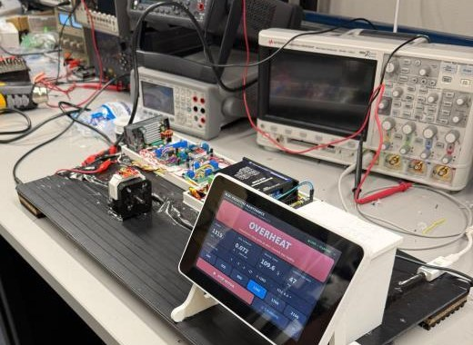

---

## At a glance

| | |
|---|---|
| **Rig** | NUCLEO-F401RE commanding a STEPPERONLINE BLD-510B driver and a 42BL41.010 motor, 24 V, 8 pole. |
| **Sensing** | Vibration and tilt from a KX134-1211, bus current from an INA240A2 across a 5 mΩ shunt, motor temperature from a 10 kΩ NTC, shaft speed from the motor's own Hall sensors. |
| **Firmware** | Bare metal. Streams 44 CSV columns at 10 Hz and classifies on board twice a second. `cd firmware && make` rebuilds it byte-identical. |
| **Dataset** | 60 runs recorded in one session, 67,110 frames, all at 100.0% frame integrity. 57 runs and 63,495 frames after three documented exclusions. |
| **Model** | Random forest on 11 measured channels over one-second windows. 99.63% held-out accuracy, 18 of 18 held-out runs called correctly, split by run and never by frame. |
| **On board** | A fixed rule ladder ahead of a 33-node tree. Zero false fires across 7,189 healthy windows. |
| **Front ends** | One Python backend under three applications: a Windows campaign app, a Raspberry Pi touchscreen and a headless web dashboard. |

---

## Quick start

```bash
pip install -r requirements.txt
pip install scikit-learn matplotlib joblib      # needed by the training and plotting tools
```

```bash
python -m apps.bench.main        # Windows campaign app
python -m apps.demo.collector    # Raspberry Pi touchscreen
python -m apps.web.server        # headless dashboard on :8080
```

There is no simulator. `SerialSource` is the only source and it is gated behind
ST-LINK detection, so an unplugged board gives a disconnected sidebar and a
five-second retry rather than invented rows. `INSTALL.bat` does the Windows side
and adds a shortcut.

---

## Results

**A campaign, not a download.** 60 runs recorded in one session, 67,110 frames,
all at 100.0% frame integrity. Three runs were pulled by hand with the reasons
written down, leaving 57 runs and 63,495 frames across healthy, loose mount,
orientation change, rotor drag and overheat.

**99.63% held-out accuracy on measured channels only, 18/18 held-out runs.**
Split by run, never by frame. A second model using gravity and tilt scores
99.97%, and that number is discarded: 28 of the 30 healthy runs predate per-axis
accelerometer streaming, so those five features separate healthy from faulted on
when a run was recorded rather than on the motor. Dropping them costs 0.34 points
and still calls every held-out run correctly.

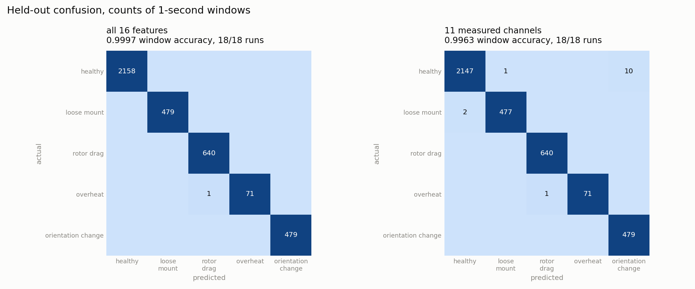

The honest model's whole error budget is 14 windows out of 3,828.

**The on-board detector fires zero false alarms on 7,189 healthy windows.** A
fixed rule ladder runs ahead of the 33-node tree and demotes any tree verdict its
own sensor does not corroborate. Replayed over all 57 runs: 0 false fires, 57/57
runs classified correctly, median detection latency 1.5 s to 2.5 s. The worst
healthy window in the campaign reaches 13.0 mV of current rise against a 30.0 mV
drag threshold.

**Not every fault is detectable, and the analysis says which.** Scoring each
channel alone against the healthy runs, rotor drag is over-determined: bus
current and vibration peak both reach AUC 1.000 at p under 3e-7. Loose mount
reaches AUC 0.605 at p = 0.404 on its best channel, which is chance. The
classifier still scores it highly by combining eleven features over one-second
windows, but no single sensor on this bench sees it.

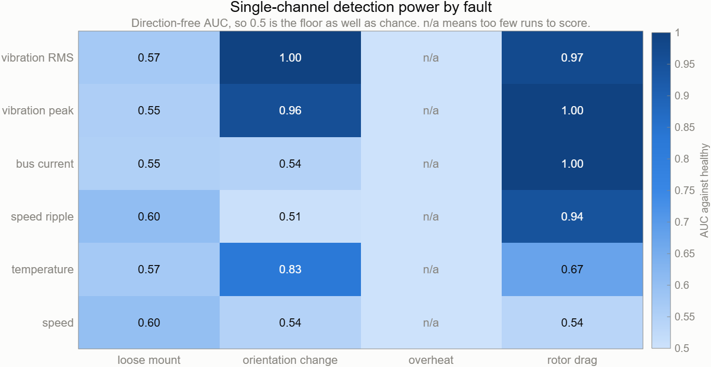

**The campaign was the right size.** The learning curve sits at 36% accuracy with
5 training runs, plateaus near 85% from 17 through 32, then reaches 99.1% at 35
and 99.63% at 40.

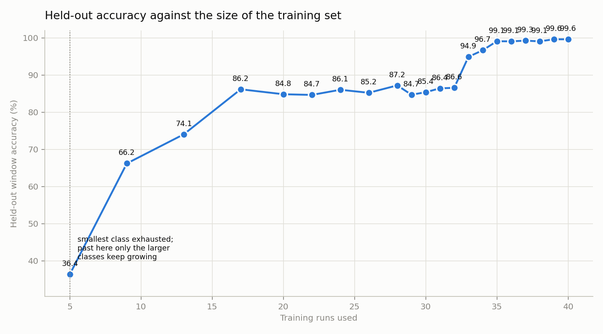


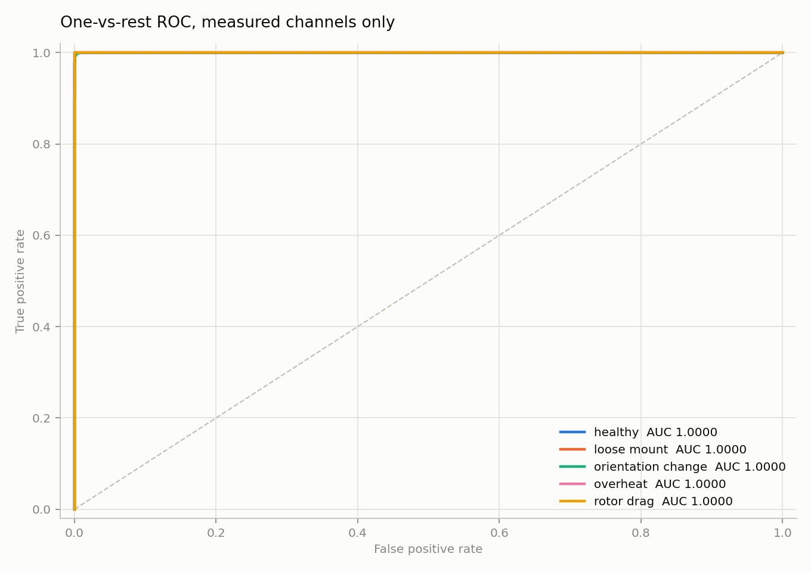

*One-vs-rest ROC on the held-out runs. Every class reaches AUC 1.000: the classes
are separable in the eleven-feature space even where no single channel separates
them.*

| class | precision | recall | F1 | windows |
| --- | ---: | ---: | ---: | ---: |
| healthy | 0.999 | 0.995 | 0.997 | 2,158 |
| loose_mount | 0.998 | 0.996 | 0.997 | 479 |
| rotor_drag | 0.998 | 1.000 | 0.999 | 640 |
| overheat | 1.000 | 0.986 | 0.993 | 72 |
| orientation_change | 0.980 | 1.000 | 0.990 | 479 |

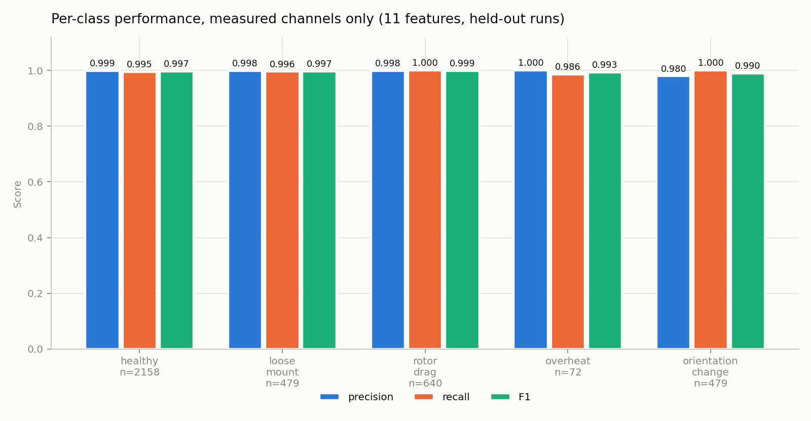

*Orientation change is the weakest on precision at 0.980, overheat the weakest on
recall at 0.986 off 72 windows.*

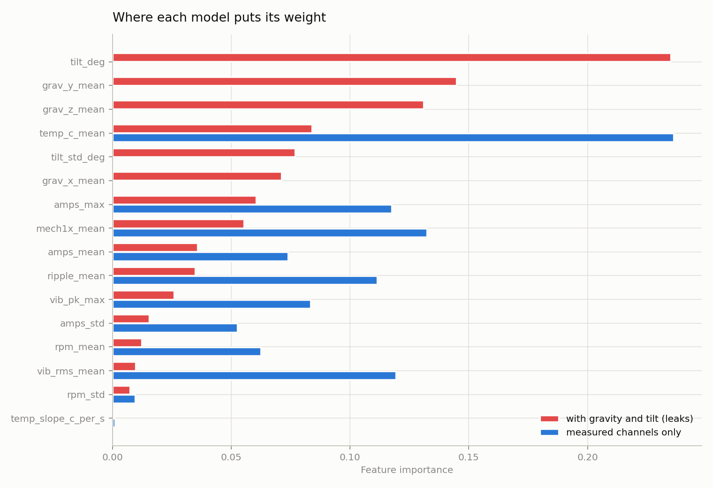

*Why 99.97% is discarded. In the 16-feature model the five gravity and tilt
features carry 66% of the forest's importance, and they leak: 28 of the 30
healthy runs predate per-axis streaming, so their gravity is a stored constant
while every fault run's is measured. The measured-channel model spreads its
weight across current, vibration and ripple instead.*

---

## The dataset

60 runs in one session, 67,110 frames at 100.0% frame integrity. Three runs were
pulled by hand with the reasons written down, leaving **57 runs and 63,495
frames**. Every figure below is regenerated by `python tools/plot_dataset.py`.

| condition | runs | speeds | vib RMS (mg) | vib pk (mg) | current (A) | ripple (‰) | temp (C) |
| --- | ---: | ---: | ---: | ---: | ---: | ---: | ---: |
| healthy | 30 | 10 | 62.2 | 175 | 0.081 | 277 | 25.1 |
| loose_mount | 7 | 3 | 77.7 | 416 | 0.085 | 282 | 24.9 |
| orientation_change | 6 | 3 | 75.8 | 236 | 0.083 | 277 | 24.0 |
| rotor_drag | 13 | 5 | 207.9 | 5810 | 0.263 | 387 | 26.3 |
| overheat | 1 | 1 | 78.3 | 199 | -0.023 | 317 | 34.0 |

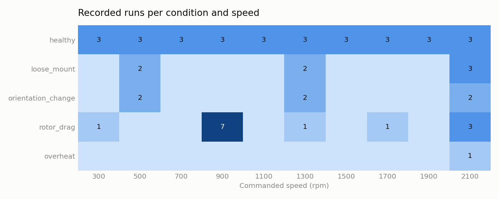

*Healthy is the only condition swept across all ten speeds. Loose mount and
orientation change were recorded at three each, which is why the trainer leans on
`class_weight="balanced"`.*

Three channels plotted against commanded speed, one line per condition. Rotor
drag separates on all three; the other faults sit on top of healthy.

| | |
|---|---|
| 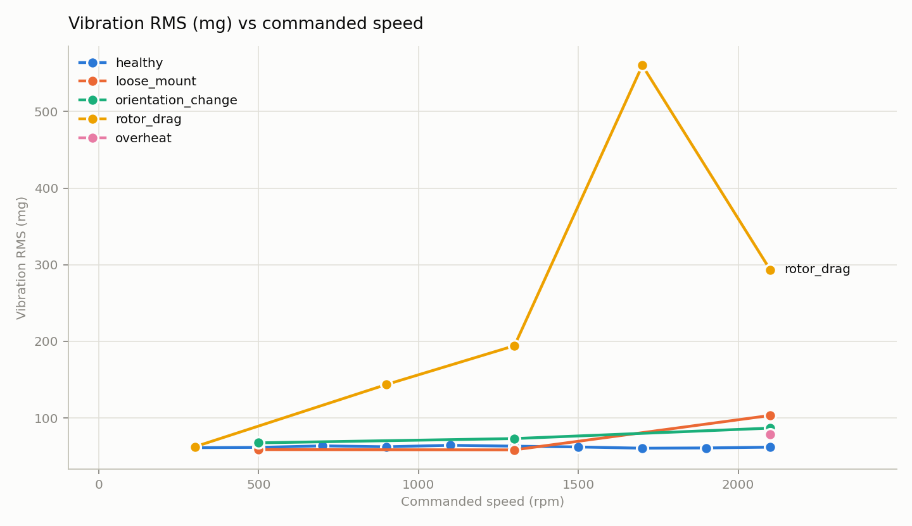 | 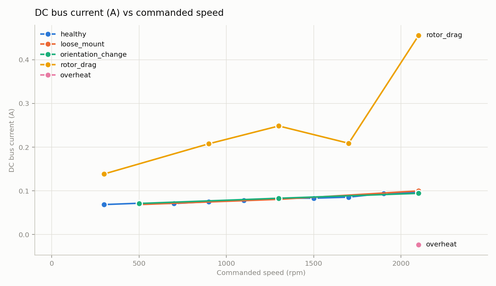 |
| Vibration RMS. Drag reaches 208 mg against healthy's 62 mg. | Bus current. Drag draws 0.263 A against healthy's 0.081 A; the other faults sit within 4 mA of healthy. |
| 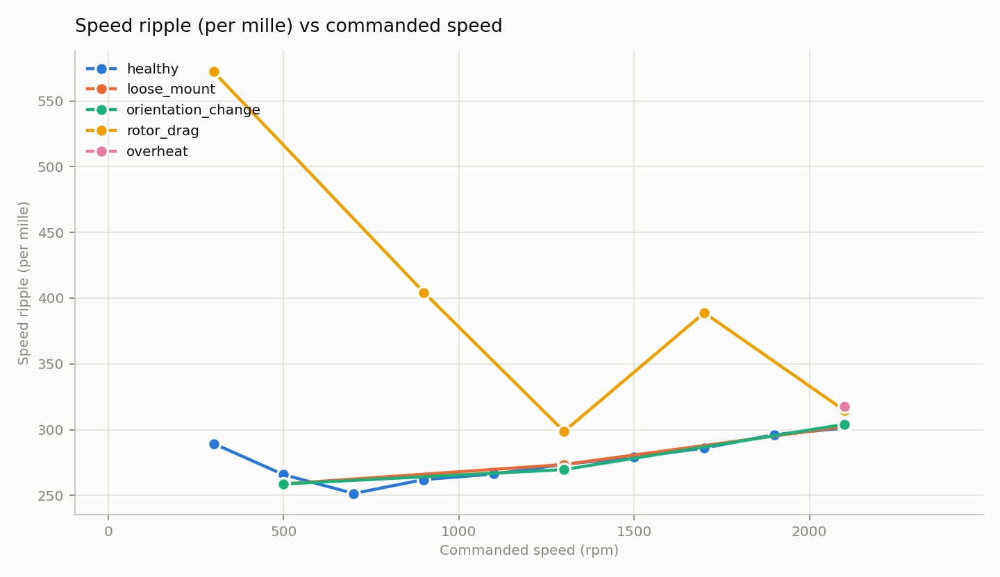 | 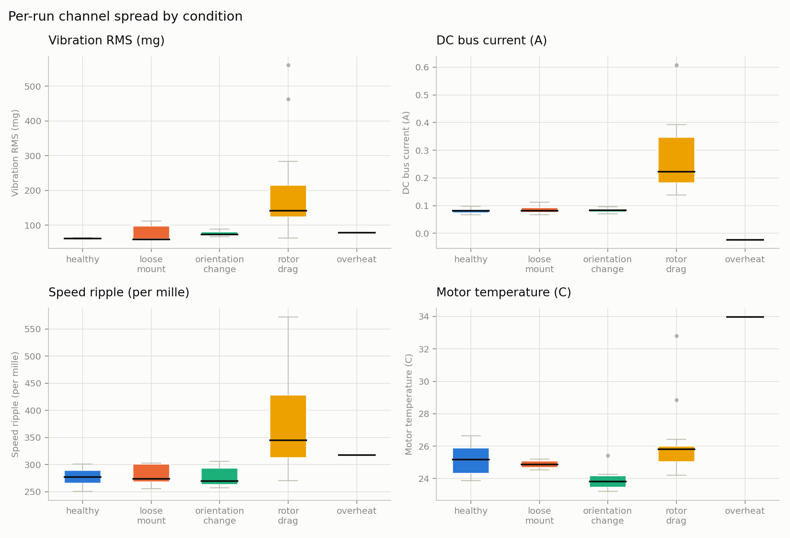 |
| Speed ripple, 387 per mille under drag against 277 healthy. | The same channels as per-run distributions. Where the boxes overlap, no single-channel threshold exists. |

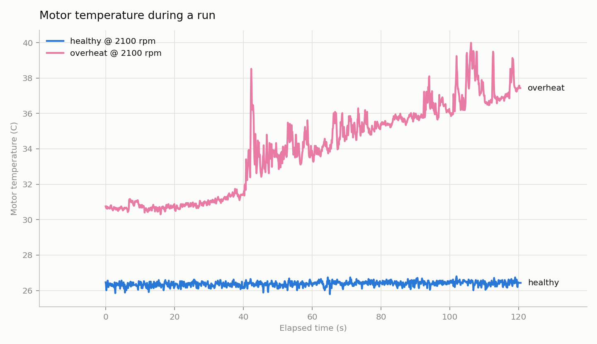

*The overheat run against a healthy run at 2100 rpm. Temperature is the one
channel that separates it, which is why the firmware rule ladder lets temperature
override the tree. It is a single run, and section 10 of the guide says what that
costs.*

## The applications

Two front ends run on the same backend. Both screenshots below are the real
applications replaying a recorded `rotor_drag` run at 2100 rpm frame by frame,
the last 25 frames at the recording's own 10 Hz. The fault verdict shown is what
the firmware rule ladder returns for that window. Regenerate them with
`python tools/capture_screenshots.py`.

### Bench app

`python -m apps.bench.main`, the Windows campaign tool used to run the test plan
and record the dataset. Speed, ripple, hall state, coast-down, measured frame
rate, frame integrity, vibration and temperature are all live off the replayed
stream, and every channel self-check reads ok.

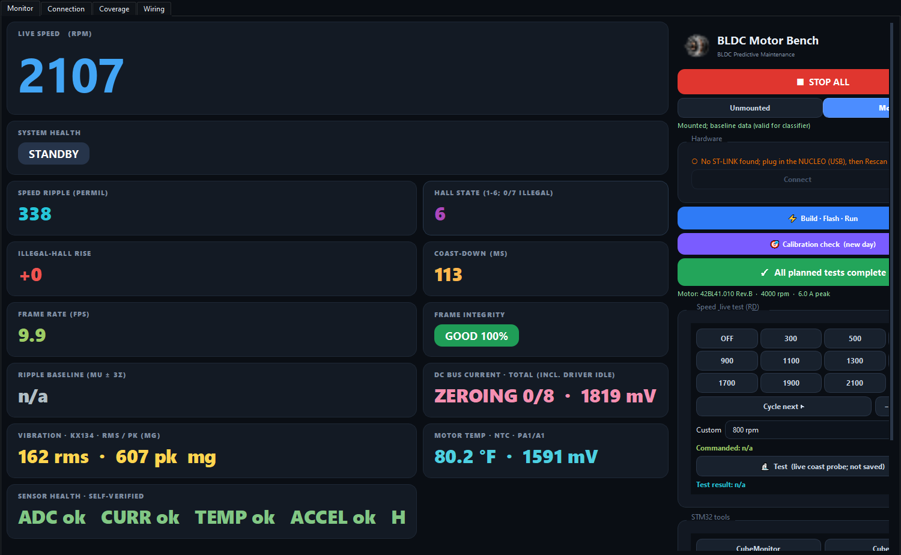

Two cards stay idle on a replay, and both are the app being strict rather than
broken. **Bus current** shows `ZEROING 0/8` because it will not publish amps
until it has watched eight consecutive flat frames with the motor commanded off;
no recording in this dataset contains a rest head, so the anchor never completes
off replayed data. **System health** stays `STANDBY` because severity scoring
needs a healthy baseline armed by the operator, which is a bench action rather
than something stored in a run.

The Coverage page is the one that ran the campaign: it tracks which
fault-by-speed cells have been recorded and how many frames each holds, so the
test plan is visible while it is being executed rather than reconstructed
afterwards.

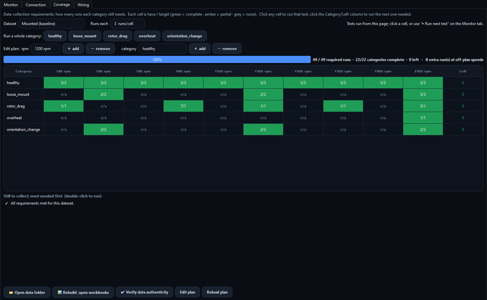

### Demo dashboard

`python -m apps.demo.collector`, the Raspberry Pi touchscreen build for an
800x480 panel. One verdict, the four numbers behind it, the orientation vector,
and speed buttons large enough to hit with a finger.

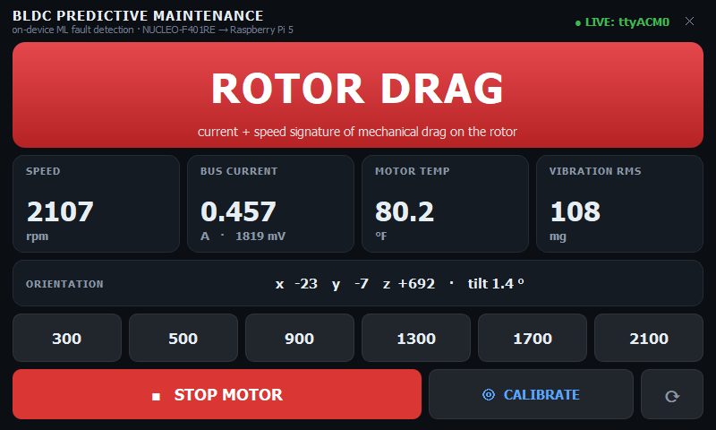

The remaining bench pages, and how to drive each application, are in
[docs/GUIDE.md](docs/GUIDE.md).

---

## Reproducing every number

```bash
python tools/plot_dataset.py                              # dataset figures and tables
matlab -batch "addpath('analysis/matlab'); channel_separability"
python tools/evaluate_model.py                            # model figures and evaluation.json
python tools/e2e_check.py                                 # 115 assertions, end to end
python tools/check_calibration.py                         # one definition per constant
python tools/check_current_anchor.py                      # per-run current zero anchors
python tools/update_core_manifest.py                      # acquisition-core hashes
python tools/validate_rules.py                            # firmware rules against the data
```

Firmware:

```bash
cd firmware && make      # build/motor.bin comes out byte-identical to the committed motor.bin
```

---

## Layout

```
bldc_phm/        the backend: schema, validation, acquisition, sessions, calibration
  config/        app_config, taxonomy, hookups, pinout, channels
apps/
  bench/         Windows PyQt campaign app
  demo/          Raspberry Pi touchscreen app
  web/           headless HTTP dashboard
firmware/        main.c, fault tree, linker scripts, Makefile; the pin map lives here
  history/       the H743 and G474RE generations that preceded the F401RE
model/           trained forest, emitted C trees, features.json, report.json
tools/           training, plotting, calibration, verification
analysis/matlab/ single-channel separability
data/            two recorded campaigns, calibration logs, verification captures
docs/            the guide, architecture, experiment design, pinout, wiring, KX134 setup
  photos/        the bench, the sensor perfboard, an overheat run in progress
  diagrams/      system block diagram and firmware flowchart, with their draw.io sources
  measurements/  twelve scope captures behind the sensor-chain claims
figures/         everything tools/plot_dataset.py, tools/evaluate_model.py and the
                 MATLAB script produce
```

---

## Documentation

**[docs/GUIDE.md](docs/GUIDE.md)** is the technical report: the design
constraints, the hardware and why each part is there, the scope measurements
behind every sensor chain, both campaigns in full, all twelve generated figures
with captions, what the automated checks cover, and the command behind every
number.

Shorter reference pages: [docs/PINOUT.md](docs/PINOUT.md),
[docs/EXPERIMENT_DESIGN.md](docs/EXPERIMENT_DESIGN.md),
[docs/ARCHITECTURE.md](docs/ARCHITECTURE.md),
[docs/WIRING_FUTURE.md](docs/WIRING_FUTURE.md),
[docs/measurements/SCOPE_CAPTURES.md](docs/measurements/SCOPE_CAPTURES.md),
[data/README.md](data/README.md).

## Known issues

- Current calibration is provisional. The A0 voltage is verified against a
  Keysight 34460A and an MSO-X 3034T; the end-to-end amps transfer function is
  anchored on one series-ammeter session over a few tens of milliamps and is not
  quotable as an absolute.
- `overheat` is a single run, split temporally. Cross-run generalization is
  untested, and that run's bus current is offset: its zero anchor was captured
  17 mV high, so its amps read about 0.065 A low and its median goes negative,
  which a turning motor cannot do. The raw sensor output matches the healthy runs
  exactly, so the anchor moved rather than the current. Run
  `python tools/check_current_anchor.py` to see it; section 10 of the guide works
  it through.
- `firmware/fault_tree.c` cannot be regenerated from this repository. It is a
  fourth model, distinct from either tree under `model/`, and the accuracy quoted
  in its header is an undocumented claim. See section 9 of the guide.
- The block diagram, the sensing schematic sheet and the scope-capture notes give
  the NTC as B = 3950; the code and the whole recorded dataset use 3550. No
  dataset value is affected. See section 11 of the guide.
- `loose_mount` and `orientation_change` were recorded at 3 speeds each against
  10 for healthy, so the classes are unbalanced and the trainer leans on
  `class_weight="balanced"`.

## Contributing

Pull requests are welcome. [CONTRIBUTING.md](CONTRIBUTING.md) lists the checks to
run before opening one.

## License

MIT. See [LICENSE](LICENSE).
