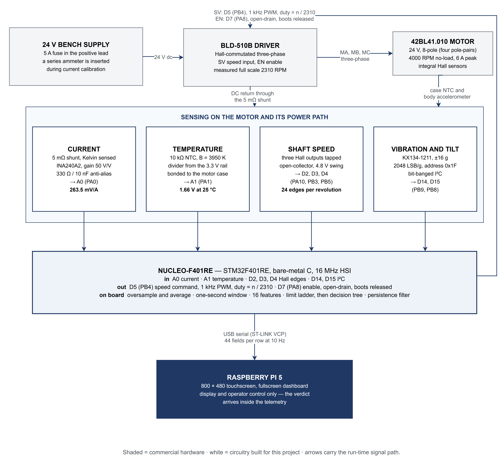
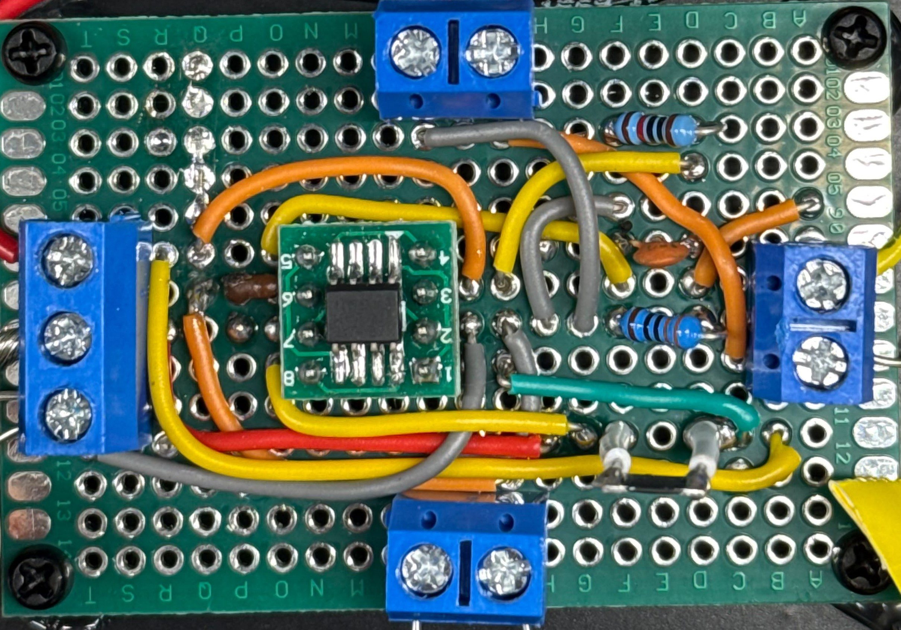
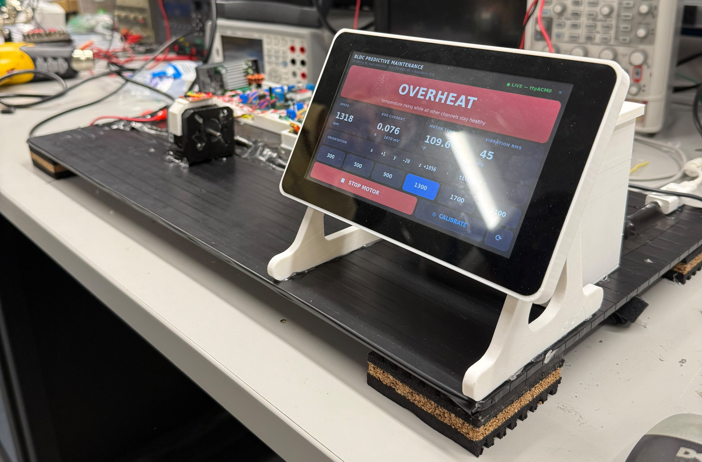
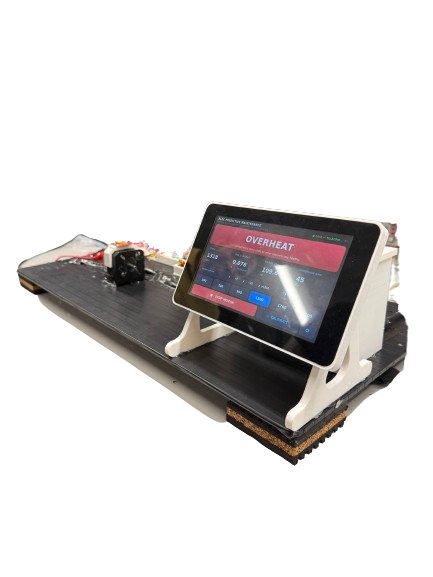
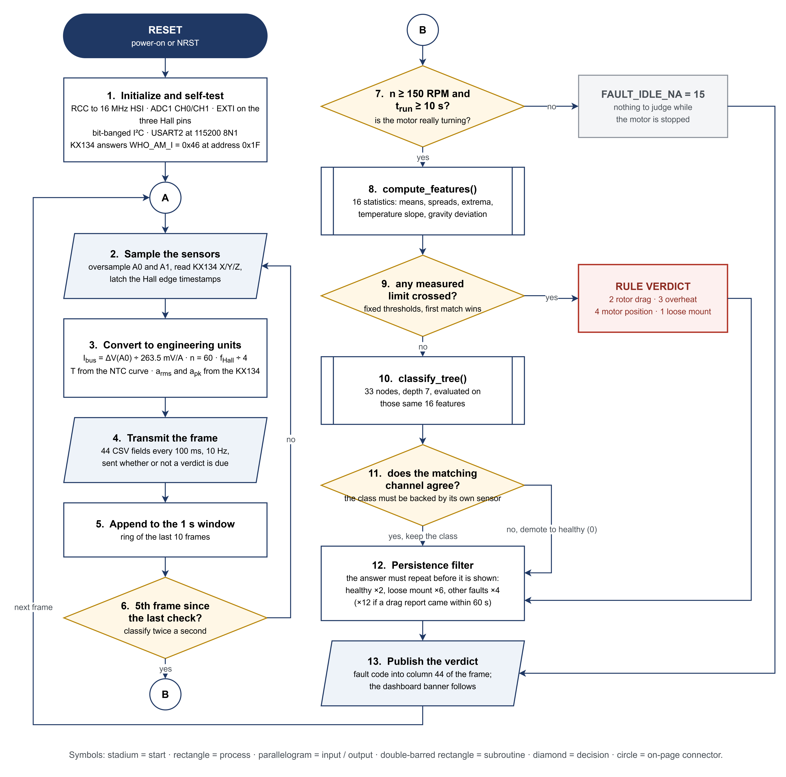
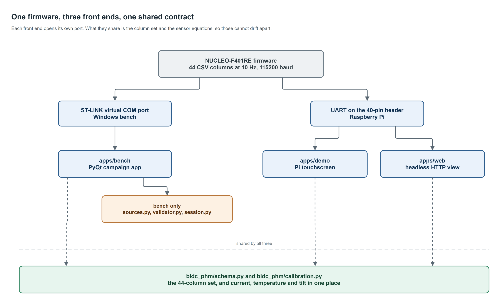
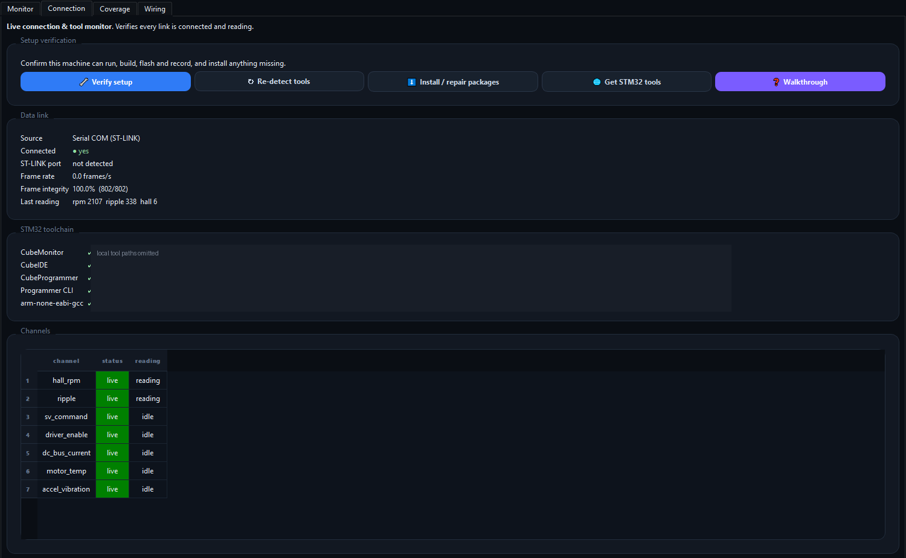
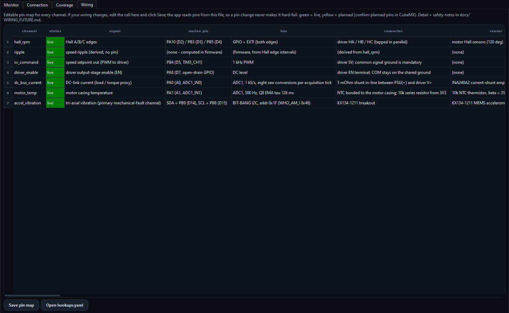

# BLDC bench: design and test report

A test bench that induces mechanical and thermal faults in a small brushless motor,
records labelled telemetry while they happen, and trains a classifier that fits inside
the microcontroller doing the measuring.

This document is the long form. It covers what the rig had to satisfy, how it is built,
what was measured, what the numbers came out as, what the automated checks actually
prove, and what is still unproven. The top-level [README](../README.md) is the short
form.

Every figure in this document is regenerated from the recorded data by a script in
`tools/`; the commands are collected in [Reproducing every number](#reproducing-every-number)
at the end.

---

## Contents

1. [What the bench is for](#1-what-the-bench-is-for)
2. [The rig](#2-the-rig)
3. [Firmware](#3-firmware)
4. [Host software](#4-host-software)
5. [Sensor-chain measurements](#5-sensor-chain-measurements)
6. [The recorded campaigns](#6-the-recorded-campaigns)
7. [What each channel sees](#7-what-each-channel-sees)
8. [The classifier](#8-the-classifier)
9. [The detector that runs on the board](#9-the-detector-that-runs-on-the-board)
10. [Verification](#10-verification)
11. [Limitations](#11-limitations)
12. [Reproducing every number](#reproducing-every-number)

---

## 1. What the bench is for

Predictive-maintenance papers are usually written against public bearing datasets whose
provenance you cannot inspect. This project starts one step earlier: build the rig,
break the motor in known ways, record what the sensors say while the fault is present,
and only then train anything. The dataset is the deliverable as much as the model is.

Five requirements shaped every decision.

**One variable at a time.** A run is only useful if the difference between it and a
healthy run is the fault and nothing else. Fixture, orientation, mount torque, cable
routing, supply and warm-up all stay fixed while one thing changes, and every one of
those variables is written into the run's `meta.json` so the claim can be audited later.
`docs/EXPERIMENT_DESIGN.md` is the working rule set.

**No invented data.** There is no simulator anywhere in the acquisition path.
`bldc_phm/sources.py` exposes exactly one source, `SerialSource`, gated behind ST-LINK
detection; an unplugged board produces a disconnected sidebar and a five-second retry,
not plausible-looking rows. A frame that fails validation is dropped whole rather than
clamped or repaired, and a channel with no hardware behind it is written blank, never
zero.

**The model has to fit the measuring device.** The classifier was always meant to run on
the NUCLEO itself, bare metal, no FPU, no dynamic allocation. That ruled out FFT
features, spectrograms and anything needing a library at inference time. Every feature is
a windowed mean, spread or extremum of a channel the firmware already computes.

**Detection within about a second.** Features are computed over a sliding one-second
window (10 frames at 10 Hz) with a half-second hop, so a fault becomes classifiable
roughly one second after it appears, and the reported verdict is a debounced version of
that.

**Software must not be the safety layer.** The STM32 only issues an analog speed
setpoint; it never commutates the motor. Over-current, over-voltage, over-temperature,
stall and illegal-Hall shutdowns all live in the BLD-510B driver, plus the enable line.
The severity scoring in this repository warns and throttles. It is not what stops the
motor.

---

## 2. The rig



*Figure 1. The signal path end to end. Shaded blocks are commercial hardware, white
blocks are circuitry built for this project. Read it as three groups: a 24 V supply
feeding a Hall-commutated driver and motor, four sensing chains hanging off the motor and
its power path, and a NUCLEO-F401RE that both commands the speed and reads all four
chains. Source: `diagrams/src/fig1_system_ece.drawio`.*

The motor is a 42BL41.010: 24 V, 8 pole (four pole-pairs), rated 1.79 A continuous and
6.0 A peak, with integral Hall sensors. It is driven by a STEPPERONLINE BLD-510B, which
takes an analog or PWM speed reference on its SV terminal and an enable on EN. Neither
part was chosen for this project so much as inherited from the bench; what mattered is
that the driver exposes its Hall lines on a terminal strip, which is what makes shaft
speed measurable without adding an encoder.

### Why each sensing chain exists

| Chain | Part | What it is there to catch |
| --- | --- | --- |
| Shaft speed and ripple | three motor Halls tapped at the driver | speed depression under load, and interval jitter as a proxy for imbalance and eccentricity |
| DC bus current | 5 mΩ shunt in the driver return, INA240A2 at gain 50 | anything that raises mechanical load: drag, seizure, a rubbing rotor |
| Motor temperature | 10 kΩ NTC bonded to the case, 10 kΩ series from 3.3 V | thermal faults, and a way to bin baselines by temperature instead of trusting a fixed warm-up |
| Vibration and tilt | KX134-1211 tri-axial accelerometer on the motor body, bit-banged I2C | looseness, imbalance, and the orientation of the motor itself |

Four details in that table are load-bearing and worth stating separately.

The current shunt sits in the **driver return**, not the positive lead, and both ends are
Kelvin-sensed into the INA240. The INA240A2 is a bidirectional current-sense amplifier
with its REF pins split between VS and GND, so its output idles near mid-supply and moves
either way. That costs half the ADC range and buys the ability to see a negative reading
when something is wrong, which turned out to matter (see section 7).

The accelerometer talks over **bit-banged I2C on PB9/PB8 (D14/D15)**, not the hardware
peripheral. The STM32F401 has a documented I2C BUSY erratum that this board hit; rather
than fight it, the firmware clocks the bus in software. `docs/KX134_SETUP_AND_CALIBRATION.md`
records the bring-up, including the mistake that cost the most time: SDA and SCL were
first wired to A4/A5, which on a NUCLEO are PC1/PC0, two ADC inputs. The A4/A5 alias for
I2C is an Arduino Uno convention, not an ST one.

The three **Hall inputs use EXTI lines 10, 3 and 5**. STM32 selects the EXTI line by pin
number rather than by port, so two Hall pins with the same number would collide on one
interrupt line and one channel would go quietly dead. The board would still boot and
still stream, just with two Halls of three. `docs/PINOUT.md` records the constraint and
`tools/e2e_check.py` asserts that the three lines stay distinct.

The **enable line is under firmware control** on PA8 (D7), open drain, released at boot.
It used to be a hard strap to COM. With EN strapped the driver is always armed, and at
SV = 0 it leaves roughly 10 mA of standby bias in the windings whenever the rotor parks
in Hall sector 2 or 4. That bias poisoned every current-zero re-anchor taken in those
sectors. Releasing EN at rest gives one flat idle instead.

### Speed ceiling

The BLD-510B's SV input is referenced to 5 V and the NUCLEO drives it with 3.3 V PWM, so
the duty command scales by 0.66 and firmware full scale lands at 2310 rpm rather than the
driver's 3500 rpm reference (`bldc_phm/firmwaregen.py`, `DRIVER_FULLSCALE_RPM = 2310`).
Anything commanded above 2310 is unreachable, which is why every planned speed in the
mounted campaign sits at or below 2100.

The scaling factor is recorded as a bench observation in the source of
`bldc_phm/firmwaregen.py`, a commanded 1200 rpm measuring 804, and is not re-derivable
from anything committed here. What the data does confirm is the ceiling: 2310 rpm is the
highest setpoint anywhere in the recorded data, used by four commissioning runs, whose
mean measured speeds over at-speed frames are 2285, 2294, 2295 and 2299 rpm.

A related failure mode is worth knowing: a motor that free-runs near 1700 rpm and ignores
commands has a floating SV wire. Check D5 first.

### Pin map

| Channel | Pin | Sensor | Notes |
| --- | --- | --- | --- |
| Hall A/B/C | PA10 (D2), PB3 (D3), PB5 (D4) | motor Halls, tapped at the driver | EXTI both edges, 24 edges per revolution |
| SV command | PB4 (D5), TIM3_CH1 | | 1 kHz PWM, duty = rpm / 2310 |
| Driver enable | PA8 (D7) | BLD-510B EN | open drain, released at rest |
| DC bus current | PA0 (A0) | INA240A2 across a 5 mΩ shunt | ADC1_IN0, ratioed against VREFINT |
| Motor temperature | PA1 (A1) | 10 kΩ NTC | ADC1_IN1, 10 kΩ series from 3V3 |
| Vibration and tilt | PB9/PB8 (D14/D15) | KX134-1211 | bit-banged I2C, address 0x1F |
| Pi telemetry | PA9 (D8) | | USART1 TX, compact fallback frame |

`bldc_phm/board_f401re.py` is the single source of truth for this map and the pin map is
compiled into `firmware/main.c`. `docs/PINOUT.md` transcribes it by hand and also lists
the six pins that must never be reassigned (the USART2 pair to the ST-LINK virtual COM
port, SWDIO/SWCLK, and the two oscillator pins).

### What it looks like assembled



*Figure 5. The hand-built sense node: an INA240A2 on a SOIC-8 breakout, the 330 Ω / 10 nF
anti-alias network, and screw terminals for the shunt Kelvin pair, the NTC divider and
the supply. Every analog measurement in this repository came through this board. It is
the single largest source of doubt about the absolute current calibration.*



*Figure 7. The full bench during an induced overheat, motor and sensing hardware on the
rail at left, the Raspberry Pi touchscreen on its printed stand at right. The dashboard
is showing the OVERHEAT banner at 1318 rpm and 109.6 C case temperature. That reading
comes from the live demo with a heat gun on the case, not from the recorded campaign; the
one recorded overheat run peaked at 40.0 C.*



*Figure 8. The same setup with the background removed, kept as a clean figure for
write-ups.*

---

## 3. Firmware

`firmware/main.c` is a single bare-metal C file against raw register addresses. No HAL,
no CMSIS, no libc, no startup assembly; it carries its own vector table, and the link is
`-nostdlib` plus libgcc for the soft-float and 64-bit division helpers the Cortex-M4 has
no instructions for. It runs from the internal 16 MHz HSI with no PLL configured.

The build is reproducible. Compiling the committed sources with the STM32CubeCLT
`arm-none-eabi-gcc` produces a `build/motor.bin` byte-identical to the `motor.bin`
committed at `firmware/motor.bin`, SHA-256
`ab9989ea4a3b804644e81dccf84398bdb5fbe068595f1c93a1ea4da8f6791eb9`. Sizes: 12,736 bytes
of text, 16 bytes of data, 912 bytes of bss. It compiles clean under `-Wall -Wextra`.

### The loop



*Figure 9. The 10 Hz loop and the twice-a-second classification path. Steps 1 to 6 are
the acquisition side: sample, convert, transmit a 44-field CSV frame, push it into a
ten-frame ring. Steps 7 to 13 are the detector: compute 16 features, try a fixed limit
ladder first, fall back to a 33-node decision tree, demote any tree verdict its own
sensor does not corroborate, then require the answer to repeat before it is published.
Source: `diagrams/src/fig2_firmware_ece.drawio`.*

Two design choices in that loop deserve the emphasis.

Hall capture lives entirely in EXTI interrupt handlers, both edges, timestamping into a
ring buffer. Main-loop work is not free: an ADC burst takes about 35 µs and the
accelerometer read about 1.2 ms. If the Halls were polled, those blocking operations
would show up as timing jitter in exactly the features derived from Hall intervals. The
earliest generation of this firmware did poll them, and that is the bug it taught.

Both ADC channels are heavily oversampled and averaged, roughly 800 conversions per
100 ms frame, and the result is published as a ratio against VREFINT rather than an
absolute voltage. The internal bandgap is a fixed reference, so ratioing removes supply
error and gives the host an independently checkable number. Figure 13 shows why the
oversampling is not optional.

### Per-channel self-verification

Every channel is checked against a physical invariant that can only hold if the wiring is
really intact, and the result is streamed as a `sensor_status` bitfield. The point is
that a broken connection should report a fault rather than a plausible-looking number.

| Channel | Invariant |
| --- | --- |
| ADC core | VREFINT is a fixed internal 1.21 V bandgap, independent of any external wire |
| Current | the INA240 idles at its mid-supply REF; an open or shorted sense pair pins the output to a rail |
| Temperature | the NTC divider must sit between the rails; an open probe pulls to VIN, a short pulls to GND |
| Accelerometer | a live KX134 always measures about 1 g in any orientation, because the vector magnitude is orientation-invariant |
| Halls | all six legal codes must appear within one revolution; a dead line makes two of the six unreachable |

### Three generations

The data node was rewritten twice. `firmware/history/` keeps the two earlier targets
because the shipped design only makes sense against them.

| | `history/h743_main.c`, on a NUCLEO-H743ZI2 | `history/g474re_main.c`, on a NUCLEO-G474RE | `main.c`, shipped, on the NUCLEO-F401RE |
| --- | --- | --- | --- |
| Speed command | DAC voltage on PA5 | TIM3_CH2 PWM on PA7 | TIM3_CH1 PWM on PB4 |
| Hall capture | polled in the main loop | GPIO | EXTI, both edges, ring buffer |
| Analog | none | bus current, VREFINT, PC0 | current, NTC, VREFINT |
| Accelerometer | none | none | KX134-1211, bit-banged I2C |
| Speed set by host | no, a button steps a table | no, a button steps a table | yes, `S<rpm>` over interrupt-driven RX |
| CSV columns at 10 Hz | 10 | 16 | 44, including an on-device verdict |
| Classification | host side only | host side only | on device |

The substantive change came in the middle generation and carried forward unchanged: an
integer DFT over the 24 Hall intervals of each mechanical revolution, against fixed Q10
cosine and sine tables, extracting two bins. Bin 1 is the once-per-revolution component,
published as `mech1x_permil`, which is the imbalance and eccentricity signature. Bin 4 is
the once-per-electrical-cycle component, published as `elec_permil`, which is fixed
Hall-spacing and magnet-spacing error baked into the motor.

Splitting those two apart is the whole point. A plain jitter metric cannot tell them
apart, so a motor's permanent Hall-spacing error sits in the timing statistics forever
and reads as a standing mechanical imbalance. That either raises the healthy baseline
until real imbalance is invisible, or trips the detector on a motor that is fine. All of
it is integer-only, magnitudes come from a 64-bit integer square root, and results are
scaled to per-mille of the mean interval, so the build needs no soft-float.

---

## 4. Host software

`bldc_phm/` is the entire backend, about 2,500 lines across seventeen modules. Three front
ends import it and none of them restate any of it.



Only the bench app uses `sources.py`, `validator.py` and `session.py`. The Pi touchscreen and the web view each open their own port and take two things from the backend: the column set and the sensor equations. That is the part which must not drift, and `tools/check_calibration.py` fails the build if a local copy of any constant reappears.

| Module | Job |
| --- | --- |
| `schema.py` | the one canonical column set (44 streamed, 61 in the wide schema) and the datasheet range limits |
| `validator.py` | rejects a frame on shape or physical range; counts `t_ms` gaps without rejecting them |
| `sources.py` | the live serial source, feeding a queue from a background thread |
| `session.py` | run folder, `data.csv`, `meta.json`; there is no run manifest, the per-run pair is the source of truth |
| `calibration.py` | current, temperature, tilt and the demo-mount frame mapping |
| `baseline.py` / `drift.py` | healthy per-state mean and sigma, then EWMA plus CUSUM scored S0 to S3 |
| `coverage.py` / `consolidate.py` | test-plan tracking and the combined workbook |
| `board_f401re.py` | the pin map, as data |
| `instruments.py` | bench instrument addresses, read from the environment rather than hard-coded |
| `modbus_source.py` | a ready-but-inert RS-485 poller for the driver's own fault flags, waiting on a MAX485 |

A time gap is counted rather than rejected on purpose: a late frame is still a real
measurement. That is why `FrameStats.time_gaps` can be non-zero on a run that logged
100 % integrity.

The three front ends differ in what they are for. `apps/bench` is the Windows campaign
application, a PyQt tool with a coverage matrix, a taxonomy-driven metadata form, live
plots and the firmware build and flash buttons; its icon is
[`app_logo.png`](../apps/bench/ui/assets/app_logo.png), packaged as
[`app_logo.ico`](../apps/bench/ui/assets/app_logo.ico) for the Windows shortcut.
`apps/demo` is the Raspberry Pi
touchscreen dashboard, deliberately standard-library-only apart from PyQt5 so it installs
from `apt` with no pip and no virtual environment. `apps/web` is a 258-line headless HTTP
view for watching a run from another machine.

One operational note that costs time if you do not know it: the ST-LINK is a single USB
device and only one program can own it. Any tool button or a firmware flash releases the
serial port first, so the connection has to be re-established afterwards.

---

### The bench application

`python -m apps.bench.main` opens the campaign tool. It is the program the dataset
was recorded with, and it has four pages.

Every screenshot in this section is the real application replaying a recorded
`rotor_drag` run at 2100 rpm rather than showing invented values. Frames are
pushed through the same entry point the serial source uses, and the last 25 are
fed at the recording's own 10 Hz, which is why the frame-rate card reads 9.9
frames/s: it is measuring the replay. The fault verdict is what the rule ladder in
`tools/validate_rules.py`, the ladder compiled into the firmware, returns for that
window. Regenerate the set with `python tools/capture_screenshots.py`.


The Monitor page is the recording screen. Live speed, speed ripple, hall state and
coast-down sit on the left with frame rate and frame integrity beside them; bus
current, motor temperature and vibration follow. The card marked `ZEROING 0/8` is
the current channel refusing to publish amps until it has anchored its zero
against eight consecutive flat frames with the motor commanded off. That anchor
cannot complete from a replay: the recorder only ever captures the steady window,
so no run in the dataset carries a rest head, and the card correctly shows
millivolts instead of a plausible current. On the bench, with the motor parked and
commanded off, it anchors in under a second and switches to amps. `SYSTEM HEALTH`
reads `STANDBY` for the same class of reason, since severity scoring only starts
once a healthy baseline has been armed, which is an operator action rather than
recorded state. The row along the bottom is the
per-channel self-check: each sensor proves itself against a physical invariant, so
a broken wire reads as a fault rather than as a number. The right-hand rail holds
the fixture toggle, the connection state, build and flash, and the speed controls.



The Connection page answers one question: is every link actually reading. Source,
connection state, frame rate, frame integrity and the last decoded reading sit at
the top; the channel table below reports each sensor as live or idle. The toolchain
block lists where CubeIDE, CubeProgrammer and the compiler were found, and is
masked in this image because those are absolute paths on the machine that captured
it.


The Coverage page is the test plan, not a viewer. It tracks which condition and
speed cells have been recorded against the plan in `bldc_phm/config/taxonomy.yaml`
and lists what is still outstanding, which is what made a 60-run campaign
finishable in one session.



The Wiring page records how each channel is physically connected. It documents the
harness; it does not configure it. The pin map that matters is compiled into
`firmware/main.c`, and the Pinout page raises a mismatch when the saved map and the
firmware disagree.

### The demo dashboard

`python -m apps.demo.collector` is the Raspberry Pi build, laid out for an 800x480
touchscreen and installable from `apt` alone.


It shows one thing prominently: the verdict, with the sentence explaining what that
fault means. Underneath are the four numbers a viewer will ask about, then the
orientation vector and tilt. The speed buttons and the stop control are sized for a
finger. It carries no plots and no test plan, because on a demo day the question is
what the motor is doing right now.

The dashboard reads the same 44-column stream as the bench app and computes nothing
of its own: temperature, tilt and the bench-frame accelerometer mapping all come
from `bldc_phm.calibration`, which is why the two applications cannot disagree
about what a reading means.

`python -m apps.web.server` serves the same state as a page on port 8080 for
viewing from another machine. It is standard library only.

## 5. Sensor-chain measurements

Before any of the campaign data means anything, the sensing chains have to be shown to be
measuring what they claim. Twelve oscilloscope captures were taken on a Keysight MSO-X
3034T on 1 August 2026. Nine carry clean waveforms, two carry caveats on their readings,
one is empty.
`docs/measurements/SCOPE_CAPTURES.md` works through all twelve in detail with the
instrument's own on-screen measurements; the four below are the ones that carry the
conclusions.

| Fig. | File | Signal | Status |
| --- | --- | --- | --- |
| 1 | [`A0_isense_1700rpm_overview_50mVdiv_10ms`](measurements/scope_captures/A0_isense_1700rpm_overview_50mVdiv_10ms.png) | bus current | good |
| 2 | [`A0_isense_1700rpm_ripple_20mVdiv_2ms`](measurements/scope_captures/A0_isense_1700rpm_ripple_20mVdiv_2ms.png) | bus current | good |
| 3 | [`A0_isense_1700rpm_commutation_20mVdiv_1ms`](measurements/scope_captures/A0_isense_1700rpm_commutation_20mVdiv_1ms.png) | bus current | good |
| 4 | [`A0_isense_1700rpm_fine_20mVdiv_200us`](measurements/scope_captures/A0_isense_1700rpm_fine_20mVdiv_200us.png) | bus current | good |
| 5 | [`HALLA_1700rpm_1Vdiv_2ms`](measurements/scope_captures/HALLA_1700rpm_1Vdiv_2ms.png) | shaft speed | filename wrong, measures 930 rpm |
| 6 | [`HALLB_930rpm_1Vdiv_2ms`](measurements/scope_captures/HALLB_930rpm_1Vdiv_2ms.png) | shaft speed | good |
| 7 | [`HALLC_1Vdiv_2ms`](measurements/scope_captures/HALLC_1Vdiv_2ms.png) | shaft speed | good |
| 8 | [`A1_ntc_temp_level_100mVdiv_10ms`](measurements/scope_captures/A1_ntc_temp_level_100mVdiv_10ms.png) | temperature | good |
| 9 | [`A1_ntc_temp_pwm_coupling_50mVdiv_100us`](measurements/scope_captures/A1_ntc_temp_pwm_coupling_50mVdiv_100us.png) | temperature | readings clipped, lower bounds only |
| 10 | [`A1_ntc_OVERHEAT_cooling_curve_roll_2s`](measurements/scope_captures/A1_ntc_OVERHEAT_cooling_curve_roll_2s.png) | temperature | flat hot level, not a cooling curve |
| 11 | [`A1_ntc_HEAT_BLAST_thermal_dive_roll_5s`](measurements/scope_captures/A1_ntc_HEAT_BLAST_thermal_dive_roll_5s.png) | temperature | good |
| 12 | [`A1_ntc_OVERHEATED_level_100mVdiv`](measurements/scope_captures/A1_ntc_OVERHEATED_level_100mVdiv.png) | temperature | empty, no signal, cited nowhere |

### The current channel is quiet enough


*Figure 10. INA240 output at steady speed, 50 mV/div, 10 ms/div. The instrument reports
1.6776 V average, 28.39 mV peak-to-peak and 3.4920 mV AC RMS across about a tenth of a
second. That AC RMS figure is the noise floor of the whole chain: shunt, amplifier,
filter and ADC input together. The smallest threshold the on-device detector uses is
30 mV, which sits 8.6 times above it. The noise would have to grow almost ninefold before
it could reach the nearest decision boundary.*


*Figure 11. The same signal at 20 mV/div, 2 ms/div. What looked like a flat band resolves
into regular ripple, 24.121 mV peak-to-peak, about 92 mA through the 263.5 mV/A
calibration. Each hump is the driver handing current from one phase to the next. This is
healthy three-phase behaviour and it sets the floor on what "quiet" can mean for this
channel.*

### The Hall signals are clean, and the filenames are not


*Figure 12. Hall C, 114.16 Hz at 49.664 % duty, 4.78 V peak-to-peak. Four pole-pairs give
shaft speed as 60 f / 4, so 1712.4 rpm. This is the genuine high-speed Hall capture of the
set. Two things to check on any Hall trace: a duty near 50 % says the rotor's poles are
symmetric, and a swing near 5 V confirms the driver's pull-up is working and that the
signal is inside what the 5 V-tolerant pins accept. The visibly sloped rising edges are
the pull-up charging wiring capacitance after the open-collector output releases; falling
edges are sharp because the transistor pulls down actively.*

The capture named `HALLA_1700rpm` measures 62.243 Hz, which is 933.6 rpm, not 1700. The
waveform is fine; only the name is wrong. It was recorded about a minute before the
Hall B capture at 930 rpm and the two frequencies agree within 2.5 %. The filename is
kept as recorded so it still matches the raw capture log, and it should be cited as
930 rpm.

### The temperature channel is noisy in a way that filters out


*Figure 13. The NTC divider node at 50 mV/div, 100 µs/div. The fuzz on the temperature
channel is not random noise; it is a train of narrow downward spikes, each one a driver
switching edge coupling into a relatively high-impedance divider node. Narrow and
periodic is the easy case: a modest capacitor plus heavy oversampling removes it, which
is why the firmware averages roughly 800 conversions per frame instead of trusting a
single conversion. The instrument prefixes all three of its measurements on this capture
with a greater-than sign, meaning the waveform runs off screen, so those values are lower
bounds and must not be quoted as exact.*

The same document flags a disagreement it did not resolve: counting spikes against the
graticule on this capture suggests a switching frequency near 15 kHz, while the bench
notes describe the pickup as 10.6 kHz. A count by eye off a screenshot is not
authoritative enough to overturn either, so it is recorded as open. Whichever is right,
it changes no conclusion about the chain.

The thermal channel's signal-to-noise case is easier. Between the room-temperature
capture (1.6607 V average, 30.789 mV AC RMS) and the settled hot capture (1.0814 V,
2.6201 mV AC RMS), about 17 C of heating moved the node by roughly 580 mV. Detecting
overheating does not need anything clever; the signal dwarfs everything trying to obscure
it.

### Current calibration status

The A0 voltage is verified: `data/verification/current_cal_session.json` records
simultaneous board, DMM and scope readings at each calibration point. Across those points
the Keysight 34460A reads about 5 to 6 mV above the board's own figure and the MSO-X 3034T
reads within 1 mV of it, on a node sitting near 1.68 V.
`data/verification/raw_ratio_points.json` records the PA0-to-VREFINT ratio at four speeds
with a standard deviation under 0.0005 in every case, which is what makes the ratio
method trustworthy.

The end-to-end transfer to amps is a different question, and it is the weakest measurement
in the project. `MV_PER_AMP = 263.5` and `IDLE_OFFSET_A = 0.053` were anchored against a
series ammeter on 30 July 2026, over a current span of a few tens of milliamps at the
bottom of the range. That is a short lever arm. **Current is treated as provisional
throughout this document**: it is used for comparisons within the dataset, where the
scale factor cancels, and not quoted as an absolute measurement.

---

## 6. The recorded campaigns

Two campaigns are committed. They must not be pooled, for reasons given below.

### The mounted campaign, which the model is trained on

60 runs recorded 30 July 2026 with the motor bolted to an instrumented baseplate,
67,110 frames total. All 60 logged 100.0 % frame integrity. Three are excluded from every
downstream tool, leaving **57 runs and 63,495 frames**, which is the set every figure and
every model number below describes.

Run durations are 80.6 s to 120.6 s, mean 111.8 s, at 10 frames per second.

The CSV width is not uniform, and the reason matters more than the fact. Thirty runs
carry 61 columns and thirty carry 64; the extra three are `accel_x_mg`, `accel_y_mg` and
`accel_z_mg`. Per-axis accelerometer streaming landed part-way through the campaign.
Split by condition, the 64-column runs are every single fault run plus two healthy runs,
and the 61-column runs are the other thirty healthy runs. That asymmetry is the source of
the label leak discussed in section 8.


*Figure 14. The 57 classifier-valid runs by condition and commanded speed. Healthy is a
dense row, three runs at each of ten speeds from 300 to 2100 rpm. The faults are sparse
by comparison: three speeds each for loose mount and orientation change, five for rotor
drag, and a single run for overheat. Everything downstream inherits this shape, which is
why the trainer runs with `class_weight="balanced"` and why the overheat result carries
the caveat it does.*

Per-run channel means, averaged by condition:

| condition | runs | speeds | vib RMS (mg) | vib pk (mg) | current (A) | ripple (permille) | temp (C) |
| --- | ---: | ---: | ---: | ---: | ---: | ---: | ---: |
| healthy | 30 | 10 | 62.2 | 175 | 0.081 | 277 | 25.1 |
| loose_mount | 7 | 3 | 77.7 | 416 | 0.085 | 282 | 24.9 |
| orientation_change | 6 | 3 | 75.8 | 236 | 0.083 | 277 | 24.0 |
| rotor_drag | 13 | 5 | 207.9 | 5810 | 0.263 | 387 | 26.3 |
| overheat | 1 | 1 | 78.3 | 199 | -0.023 | 317 | 34.0 |

### The three excluded runs

Not one of them was excluded for frame integrity; all 60 recorded runs logged 100.0 %.
There is an integrity rule in the campaign app, `QUALITY_MIN = 90`, but it discards a
finished run outright rather than flagging it, and it never fired on this campaign. The
three exclusions are tagged `valid_for_classifier=false` in their `meta.json`, one
automatically and two by hand.

| Run | Why | How it was caught |
| --- | --- | --- |
| `healthy/1100rpm/S014` | `t_ms` rolled over mid-run, so elapsed time reads -4174 s. The authenticity check cannot verify rpm against Hall edges across a negative interval and returns SUSPECT. | automatic: anything short of VERIFIED is kept out of the classifier |
| `healthy/1500rpm/S021` | mean current sits 7.1 mA below its two sibling 1500 rpm runs, the zero having anchored on a boundary Hall park | by hand, in a QA sweep the same day |
| `loose_mount/2100rpm/S039` | labelled 2100 rpm, but the motor never turned; a startup park-blip raced the batch's speed command and the run recorded a stationary bench | by hand; a label-versus-measurement gate in the app now catches this automatically |

This is hand curation with the reasons written down, not an automated threshold. The two
hand-pulled runs carry a full `invalidated_reason` string in their `meta.json`. S014,
pulled automatically, carries only `authenticity: SUSPECT`, so the rollover explanation
above is reconstructed from its data rather than recorded at the time.

All three are kept on disk, and `tools/plot_dataset.py --include-invalid` will plot them.
`meta.json` is authoritative, not the per-row `valid_for_classifier` column inside
`data.csv`: that column is stamped as the run records, before the stop-time and QA
verdicts exist, so all three excluded runs still say `true` in their own CSV. Every tool
that reads the dataset honours the flag, so the figures and the model describe the same
57 runs.

### The commissioning campaign

`data/commissioning_unmounted/` holds an earlier campaign, 33 sessions recorded 20-21
June 2026, 27,367 rows, taken **before the motor was bolted down**. It is committed
because it is real data and because it contains two fault classes the mounted campaign
does not.

| Condition | Sessions | Speed setpoints (rpm) |
| --- | ---: | --- |
| healthy | 19 | 500, 800, 1100, 1400, 1600, 1700, 1800, 2000, 2200, 2310 |
| imbalance | 6 | 500, 800, 1100, 1700, 2000, 2310 |
| phase_asymmetry | 5 | 500, 1100, 1700, 2000, 2310 |
| looseness | 2 | 1400, 2310 |
| drag | 1 | 1400 |

It is tagged `valid_for_classifier = false` throughout, and the baseline builder refuses
to draw from it unless explicitly told. Four reasons, in descending order of how much they
matter:

The motor ran free and uncoupled. For a vibration-based classifier the fixture is not a
nuisance parameter, it is most of the signal; the mechanical impedance, resonances and
rigid-body modes of a free motor bear no relation to a bolted-down one.

There was no accelerometer on the motor yet. All 33 sessions record
`accel_location: none_yet`, and across the campaign the accelerometer, temperature and
current columns are empty. Only the Hall-derived channels carry data.

The firmware was a different generation with different feature maths (see section 3).

Frame capture was less reliable. Every mounted session logged 100 % good frames; here the
median is 100 % but the worst session kept 21.9 %. Seven sessions are flagged
`validated: REVIEW` against 26 PASS, and two carry `authenticity: SUSPECT`.

`combined_data.csv` in that directory is a partial mid-campaign export, 12,849 rows
covering S001 to S025 only. The per-session files are the complete record. Training or
evaluating on a mix of the two campaigns produces a model that has learned the fixture,
not the fault.

---

## 7. What each channel sees

Rotor drag is the fault you can see without a model. It triples vibration RMS (207.9 mg
against 62.2 mg, a factor of 3.34) and triples bus current (0.263 A against 0.081 A, a
factor of 3.25). Its vibration peak is a factor of 33 above healthy.


*Figure 15. Per-condition mean vibration RMS at each commanded speed. Drag separates from
everything else and its separation grows with speed, from roughly equal at 300 rpm to
560 mg at 1700 rpm. The other three conditions sit in a band from about 55 to 105 mg
across the whole speed range, with loose mount and orientation change only pulling clear
of healthy above 1500 rpm.*


*Figure 16. The same picture in bus current, and the cleaner of the two. Healthy, loose
mount and orientation change lie on top of each other from 300 to 2100 rpm, within 4 mA
of one another as run means (0.081, 0.085 and 0.083 A). Drag sits two to five times
higher at every speed. Read together with Figure 15: drag is the only fault this rig
detects from the supply side, and the supply side sees nothing else.*

*The overheat point sits below zero, at -0.023 A, and a turning motor cannot draw
negative bus current. That run's anchor is wrong, not its sensor; the next section
works through it. Nothing else in this report quotes overheat current.*


*Figure 17. Speed ripple, per-mille of the mean Hall interval. Drag separates again but
less sharply and in the opposite direction to intuition: its ripple is worst at the lowest
speed, 573 permille at 300 rpm, falling as speed rises. The other three conditions track
each other within about 10 permille everywhere. Ripple is the channel that comes closest
to seeing a loose mount, and Figure 20 shows that "closest" still means "not at all".*


*Figure 18. Distribution rather than mean: each box is the spread of per-run values within
a condition, on four channels at once. Two things to take from it. First, the healthy
boxes are tight on every channel, which is what a controlled fixture buys. Second, the
drag boxes on vibration RMS and bus current do not overlap the healthy boxes at all, while
the loose-mount and orientation-change boxes overlap healthy almost completely on every
channel except temperature.*

### The overheat run


*Figure 19. The one overheat run against a healthy run at the same 2100 rpm. The overheat
trace climbs from a 30.7 C start to 37.5 C at the end, peaking at 40.0 C, with the
step near 40 s where the heat source was applied. The healthy comparison holds 26.4 C with
a total span of 1.0 C over two minutes. Temperature is what identifies this class;
nothing else on the bench moves like that.*

The current channel on that run reads -0.023 A, below zero, which is physically
impossible for a motor drawing power. Heat reached the sense electronics and walked the
INA240 offset negative; the run's minimum sample is -0.607 A. This is a real result about
the instrumentation, not about the motor, and it is the reason the class caveat in
`model/report.json` says in as many words that temperature is that class's true signature
and the current channel on that run is not trustworthy.

### Which sensor detects which fault, on its own

Each channel was scored on its own against the healthy runs by the area under its ROC
curve, with a Wilcoxon rank-sum p value and Cliff's delta alongside. Run in MATLAB, which
has the rank statistics; the script reads `figures/runs.csv`, so `plot_dataset.py` has to
run first.


*Figure 20. Direction-free AUC of each channel against healthy, per fault class. Read the
statistic before the numbers: the script reports max(a, 1 - a) so that a channel which
drops on a fault still counts as a detector, which makes 0.5 the floor as well as chance.
Anything in the 0.5 to 0.6 band is the floor, not a measurement, and only the p value
distinguishes it from noise. The overheat column is n/a throughout: one run is too few to
rank-sum.*

The three results in that figure:

**Rotor drag is over-determined.** Bus current and vibration peak both reach AUC 1.000,
at p = 2.7e-7 and 2.6e-7. Vibration RMS reaches 0.972 and speed ripple 0.944. Four
independent channels see it.

**Orientation change is carried by vibration RMS**, at AUC 1.000, p = 1.45e-4, with
vibration peak at 0.956 and temperature at 0.828. Current and speed see nothing.

**Loose mount is not detectable from any single channel.** The best is speed ripple at
AUC 0.605, p = 0.404, which is chance. Vibration RMS, the channel you would expect to
carry it, is 0.571 at p = 0.574. Every channel is in the same band. The classifier still
scores the class highly, because it works on one-second windows across eleven features
jointly rather than on run means, but with seven loose-mount runs and no single-channel
signal this is the least proven of the four faults.

That table covers the 57 classifier-valid runs. Computed over all 60 it put a stationary
bench (S039) into the loose-mount group, which inflated the loose-mount vibration-RMS AUC
to 0.625.

---

## 8. The classifier

Windows of ten frames (one second at 10 Hz) with a five-frame hop. Sixteen features:
means, spreads and extrema of current, speed, ripple, the 1x mechanical component,
vibration RMS and peak, temperature and temperature slope, plus per-axis gravity and two
tilt features. Random forest, 200 trees, `class_weight="balanced"`, and a depth-7
decision tree emitted to C alongside it.

The split is **by run**, never by frame, so no window from a run can land on both sides.
The single-run overheat class is split temporally, first 70 % train and last 30 % test,
and reported with that caveat attached. Held out: 18 runs, 3,828 windows, against 8,796
training windows.

| Model | Features | Held-out windows | Held-out runs | Emitted C tree |
| --- | ---: | ---: | ---: | --- |
| Random forest, all features | 16 | 99.97 % | 18/18 | 35 nodes, 99.97 % |
| Random forest, measured channels only | 11 | 99.63 % | 18/18 | 83 nodes, 88.71 % |

**Quote 99.63 %.** The 16-feature number is inflated by a leak, and the rest of this
section is about why.

### Why there are two numbers

Five of the sixteen features are gravity and tilt, and those five leak the label. Twenty
eight of the thirty healthy runs that reach the classifier were recorded before the
firmware streamed per-axis accelerometer data, so their gravity is filled in from a stored
constant, while every one of the 27 fault runs streams the real thing. That makes
`tilt_deg` exactly 0.000 with zero variance on almost every healthy run and non-zero on
every faulted one. It is a fact about when a run was recorded, not about the motor.


*Figure 21. The leak in one picture. In the 16-feature model (red) the top three bars are
`tilt_deg`, `grav_y_mean` and `grav_z_mean`, and the five gravity and tilt features carry
65.9 % of the forest's importance between them, with `tilt_deg` alone at 0.235. Drop them
and the weight (blue) redistributes onto exactly what you would pick by hand:
`temp_c_mean` 0.236, `mech1x_mean` 0.132, `vib_rms_mean` 0.119, `amps_max` 0.118,
`ripple_mean` 0.111.*

Dropping the five costs 0.34 points of window accuracy and still calls all 18 held-out
runs correctly. The physics carries the result. `tools/train_model.py` prints a
gravity-provenance table on every run and warns when one class is entirely imputed and
another entirely measured.

### What the model gets wrong


*Figure 22. Held-out confusion in counts of one-second windows, the 16-feature model at
left and the honest one at right. The honest model's entire error budget is 14 windows out
of 3,828: 10 healthy called `orientation_change`, 1 healthy called `loose_mount`, 2
`loose_mount` called healthy, and 1 `overheat` called `rotor_drag`. Only one pair is
confused in both directions, healthy and `loose_mount`, once each way. A fault is called
healthy twice in total, both times `loose_mount`, which is exactly the class Figure 20
says nothing detects on its own.*


*Figure 23. Per-class scores for the 11-feature model with support counts. `orientation_change`
has the lowest precision at 0.980, which is the other side of those 10 healthy windows.
`rotor_drag` is strongest at F1 0.999, which matches the raw channels: it is the one fault
two separate sensors see on their own. `overheat` shows the smallest support at n = 72,
one run split temporally, and its recall of 0.986 is a single misclassified window.*


*Figure 24. One-versus-rest ROC, measured channels only. Every curve is saturated; all
five AUCs round to 1.000, the lowest being `loose_mount` at 0.99996. That is worth stating
plainly rather than presenting as a result. At window level the classes separate so
cleanly that AUC stops discriminating between them, so the confusion matrix and the
per-class table carry the real information and this figure carries none.*

### How much data it took


*Figure 25. Held-out window accuracy against the number of training runs used. Accuracy
is 36.4 % on 5 runs, climbs to 86.2 % by 17, then sits on a plateau between 84.7 % and
87.2 % for fifteen more runs before jumping to 94.9 % at 33, 99.1 % at 35 and 99.63 % at
40. The plateau is the healthy-versus-`orientation_change` confusion from Figure 22: it
does not clear until enough healthy runs are in the training set to pin that boundary. The
dotted line at 5 marks where the smallest class (overheat, one run) is exhausted, so the
whole curve to its right is about growing the larger classes, mostly healthy coverage,
rather than about faults.*

### What this result is not

`overheat` is one run, split temporally. It shows the model can follow a heat ramp whose
beginning it has already seen. It shows nothing about a second overheat run.

The emitted C tree is the weaker half of the honest result: 88.71 % at 83 nodes, against
the forest's 99.63 %. `model/fault_tree.c` is the 16-feature tree and inherits the leak.
`model/fault_tree_nogravity.c` is the one to build on.

---

## 9. The detector that runs on the board

`firmware/fault_tree.c` is **neither of the trees under `model/`**, and this is the
weakest link in the repository.

It is a fourth model: a depth-7, 33-node tree over MCU-proxy features in raw millivolts,
milli-g and per-mille rather than physical amps and Celsius. **Nothing in this repository
regenerates it.** `tools/train_model.py` writes only the two trees under `model/`; the
training pass that produced `firmware/fault_tree.c`, `model/features_mcu.json` and
`model/fault_model_mcu.joblib` was not committed. The header of that file quotes a
held-out accuracy of 0.9992, and a reader cloning this repository cannot check that
number. It is an undocumented claim and the file says so at the top.

It also splits on `gdev_mean`, gravity deviation, at its root, so it inherits the same
provenance leak described in section 8, on the device that actually runs.

Do not drop `model/fault_tree.c` into `firmware/` to fix this. All three files export the
same `fault_tree_classify()` behind the same header but expect different feature vectors
in different units, so the swap used to compile, link and classify garbage in silence.
`fault_tree.h` now carries a `FAULT_TREE_FEATURE_SET` macro that `main.c` static-asserts,
so it fails the build instead. Retraining the MCU tree properly means committing the
proxy-feature pipeline first.

### What keeps the leak off the fault LED

The tree's verdict is never trusted alone. A hand-written rule ladder in `main.c` runs
first, and the tree only gets a say when no rule matched.

| Rule | Condition | Verdict |
| --- | --- | --- |
| drag | window-mean current above 30 mV over the anchor, or max above 90 mV, or a speed depression above 250 rpm with current above 16 mV and steady speed | rotor drag |
| overheat | NTC node fallen more than 120 mV below the session's own rest baseline, roughly 3.5 C | overheat |
| position | gravity deviation above 900 mg, or above 220 mg while steady (deviation spread under 20 mg) | orientation change |
| loose | no warming, current under 20 mV, gravity deviation above 55 mg and stable window to window | loose mount |

If none of those fires, the tree decides, and its fault claim is then demoted to healthy
unless a milder version of that fault's own physics backs it: current at least 16 mV for
drag, at least 80 mV of temperature drop for overheat, at least 180 mg of gravity
deviation for a position change, and for loose mount either 45 mg of deviation or a 700 mg
vibration peak.

Whatever survives that goes through a persistence filter: healthy has to win two
consecutive windows, most faults four, and loose mount six, rising to twelve if a drag
report landed within the previous 60 s. That last exception exists because a hand placed
on the rig displaces it by three to five degrees in exactly the way a loose mount does.

The overheat guardrail deserves its own note. With one overheat run in training, and heat
in that run also dragging the current zero negative, live heating can read as high current
and land in the broad rotor-drag leaf before the narrow overheat leaf. Temperature is the
authoritative overheat signature, so a temperature rise above the session baseline
overrides the tree outright. The override still passes through the debounce.

`tools/validate_rules.py` replays this exact ladder, with the same windowing and the same
debounce, over all 57 classifier-valid runs:

```
=== 1. FALSE-POSITIVE EXPOSURE (healthy windows) ===
healthy at-speed windows: 7189
hard-rule false fires:    0   <- MUST be 0
demotion-gate exposure:   0 windows where a stray tree claim could survive

=== 2. DETECTION PER CLASS (with debounce) ===
             healthy: 30/30 runs correct
         loose_mount: 7/7 runs correct  median latency 2.5s
  orientation_change: 6/6 runs correct  median latency 1.5s
            overheat: 1/1 runs correct  median latency 2.5s  CROSS-LATCHES: ['S060:[1]']
          rotor_drag: 13/13 runs correct  median latency 2.5s  CROSS-LATCHES: ['S047:[1]', 'S049:[1]', 'S054:[1]', 'S058:[3]', 'S059:[1]']

=== 3. THRESHOLD MARGINS (healthy worst-case vs rule) ===
dmv_mean  max   13.0  vs DRAG rule  30.0  (gate 16.0)
dmv_max   max   13.0  vs DRAG rule  90.0
gdev_mean max   30.2  vs LOOSE rule 55.0  (gate 45.0)
gdev_std  max   15.0  vs LOOSE rule 30.0
dT        max   11.6  vs HEAT rule  120.0  (gate 80.0)
vib_pk    max    175  vs LOOSE gate 700.0
```

Zero false fires on 7,189 healthy windows, every run classified correctly, and detection
latencies of 1.5 s to 2.5 s. The threshold margins are the interesting part: the worst
healthy window in the whole campaign reaches 13.0 mV against a 30.0 mV drag rule, and
11.6 mV of temperature drop against a 120 mV overheat rule.

The cross-latch column is honest reporting, not a pass. Six of the fault runs transiently
latched a second class before settling on the right one, five of them latching loose mount
during a rotor-drag run. The drag cooldown in the ladder exists because of exactly that.

Section 11 explains why the loose-mount margin in that output is much weaker evidence than
the drag and heat margins.

---

## 10. Verification

Four scripts, all runnable without hardware.

### `tools/e2e_check.py`

115 assertions in ten groups, exercising the acquisition path end to end. All 115 pass.

| Group | What it exercises |
| --- | --- |
| 1. Modules | every backend module imports and exposes what the front ends use |
| 2. Firmware wire format | real frame text through `parse_and_validate`, including the rejection paths |
| 3. Application structure | the campaign app's tabs, actions and state machine |
| 4. Current and temperature | the anchored current channel, Hall-sector normalization, the A1 chain |
| 5. Config consistency | `app_config`, taxonomy, pinout and channel definitions agree |
| 6. Scheduler | run timing and the batch runner |
| 7. Full data path | wire text to parsed frame to raw affine to CSV row to workbook cell |
| 8. Live card | the live display renders the same raw frame it was handed, with no hidden filtering |
| 9. Acquisition core integrity | SHA-256 manifest over `main.c`, `validator.py`, `sources.py`, `schema.py`, and an assertion that `SimulatorSource` has zero construction sites |
| 10. Board identity | the firmware pin map is the F401RE map, SV is PB4/TIM3_CH1, the Hall EXTI lines are distinct, the ceiling is 2310 rpm, and `docs/PINOUT.md` agrees with `board_f401re.py` |

Group 9 is the one that earns its keep. The manifest means the four files that decide what
gets recorded cannot change without the check noticing, and the `SimulatorSource`
assertion means the "no invented data" requirement is enforced rather than promised.

**What it does not prove.** It never talks to hardware. It proves the software will handle
a correct frame correctly and reject a malformed one; it proves nothing about whether the
sensor on the other end is measuring the right thing.

### `tools/check_calibration.py`

Compares every calibration constant between `bldc_phm/config/app_config.yaml` and the
baked defaults in `bldc_phm/calibration.py`, then scans the front ends for local copies.
Current output: eight constants matching, five importers clean.

This check exists because the front ends used to carry their own copies of the sensor
equations and had drifted. The demo app and the web view computed NTC temperature with
B = 3950 while the config, the firmware header and the recorded dataset all use 3550, so
the same millivolts read cooler on the demo screen than in the data, in the direction that
under-reports heat. The two curves agree at the 25 C calibration point and diverge above
it: across the range the dataset covers, 22.5 C to 40.0 C, the error is 0.5 C at 30 C,
0.9 C at 34 C and 1.6 C at 40 C, worst exactly where it matters. Both front ends now
import the shared module and the check fails if a local copy reappears.

### `tools/validate_rules.py`

Covered in section 9. It proves the firmware's hard rules do not fire on any healthy
window in the campaign, and that every fault run latches its own class. It proves this
against recorded data replayed in Python, not against the compiled firmware, so it
validates the thresholds and the logic, not the C implementation of them.

### `tools/doctor.py`

Environment check: Python and packages, ST-LINK enumeration, `arm-none-eabi-gcc`,
STM32CubeProgrammer, and whether the board is plugged in. It answers three questions
directly, whether you can run the app, whether you can flash firmware, and whether the
board is present, and names the missing tool when the answer is no.

### Firmware

The firmware build is reproducible to the byte, as recorded in section 3, which means the
committed `motor.bin` provably corresponds to the committed `main.c`. The authority on
what is wired is `bldc_phm/board_f401re.py` plus `firmware/main.c`, which group 10 of
`e2e_check.py` cross-checks against `docs/PINOUT.md`.

---

### The overheat run's bus current is offset

Bus current is derived rather than measured. `amps_from_mv()` subtracts a per-run
zero anchor that the bench app learns with the output stage released, and each
row records the anchor it used in `i_dc_zero_mv`. Get that anchor while the stage
is not actually at rest and every amp in the run shifts by a constant.

That happened once, on the single overheat run:

```bash
python tools/check_current_anchor.py
```

```
runs whose median turning current is at or below zero: 1
  overheat/2100rpm/S060_20260730-234952
    666 of 1200 turning frames negative (56%), median -0.0191 A
    raw sensor 1649 mV, zero anchor 1668 mV, +17 mV against healthy = +0.065 A
```

The raw INA240 output is the thing to compare, and it settles the question. At
1649 mV it is indistinguishable from the healthy runs at the same speed, which
sit at 1649 to 1650 mV. The sensor saw what it always sees. The anchor is 17 mV
above the healthy median of 1651 mV, and 17 mV over 263.5 mV/A is 0.065 A, which
is the whole of the discrepancy. Two rotor-drag runs also dip negative on 6 to 8%
of their frames, but their medians are +0.25 A and +0.13 A against raw readings
of 1751 and 1727 mV: that is bus ripple crossing zero, not an offset, and the
tool reports those separately rather than flagging them.

The run is kept, unaltered, for two reasons. Its temperature channel is the point
of the run and is unaffected, and re-deriving its amps against a borrowed anchor
would mean publishing a number no anchor of its own supports. What it costs is
stated here rather than patched: `overheat` is one run, its current features are
offset by roughly 0.065 A, and the classifier has eleven features of which three
are current. Section 11 already treats overheat as the least proven of the four
fault classes, and this is a second reason for that, independent of the run count.

## 11. Limitations

**The absolute current scale is not established.** The A0 voltage is verified against a
Keysight 34460A and an MSO-X 3034T. The amps transfer function is anchored on a single
series-ammeter session over a few tens of milliamps. Comparisons within the dataset are
sound because the scale factor cancels; absolute current is not quotable until a fresh
series-ammeter sweep across a wider span exists.

**The loose-mount false-positive margin is much thinner than it looks.** The
`validate_rules.py` output reports gravity deviation on healthy windows topping out at
30.2 mg against a rule at 55 mg. Split by provenance, 6,709 of those 7,189 healthy windows
come from runs with no per-axis accelerometer data, where gravity is a stored constant and
the deviation is a rounding artefact of at most 0.32 mg. The rule is genuinely exercised
by 480 windows from two runs, S031 and S032, which is where the 30.2 mg comes from. The
drag and overheat margins do not have this problem: current and temperature are measured
on all 57 runs.

**`overheat` is one run.** Everything said about that class, in the forest, in the tree
and in the rule ladder, rests on a single 120-second recording split temporally. Cross-run
generalization is unproven, and `model/report.json` says so.

**`loose_mount` is invisible to every individual channel.** AUC 0.605 at p = 0.404 for the
best of six. The classifier's 99.7 % F1 on that class comes from eleven features jointly
over one-second windows, on seven runs at three speeds. Treat it as the least proven of
the four.

**Classes are unbalanced by design and by accident.** Healthy was recorded at ten speeds,
loose mount and orientation change at three each. The trainer leans on
`class_weight="balanced"` to cope, which is a mitigation, not a fix.

**`firmware/fault_tree.c` cannot be regenerated from this repository.** Its quoted 0.9992
accuracy is unverifiable by a reader. See section 9.

**The load axis is empty.** There is no controlled load mechanism, no brake, dyno or
generator, so every run in both campaigns is `no_load`. The experiment design reserves the
load axis and the taxonomy carries the fields; nothing has been recorded against them.

**Three documents disagree with the code on the NTC B value.** The system block diagram
(Figure 1), the sensing schematic sheet (Figure 4) and the derived temperatures in
`docs/measurements/SCOPE_CAPTURES.md` all use B = 3950. The code path uses 3550:
`bldc_phm/calibration.py`, `app_config.yaml` and the whole recorded dataset. Checked
directly against the data, a `temp_mv` of 1264 in the overheat run is written as 37.43 C,
which is the B = 3550 value; B = 3950 gives 36.13 C. The consequence is confined to the
scope document's derived temperatures: its hot-level figure of 42.1 C would be 44.2 C on
the software's curve. No dataset value and no model input is affected. The discrepancy is
recorded rather than silently corrected, because which thermistor is physically on the
motor has not been re-established.

**Two more capture-level issues are open**, both from section 5: the switching-frequency
disagreement between 10.6 kHz and roughly 15 kHz, and the Hall A capture whose filename
says 1700 rpm while the instrument measured 933.6 rpm.

**The training and plotting tools are not covered by `requirements.txt`.**
`tools/train_model.py` and `tools/evaluate_model.py` need scikit-learn and joblib, and the
plotting tools need matplotlib; none of the three is listed. Section 12 gives the versions
these results were produced under.

---

## Reproducing every number

Python 3.13.13 on Windows. Package versions these results were produced under: numpy
2.2.6, pandas 3.0.1, scipy 1.16.2, matplotlib 3.10.8, scikit-learn 1.9.0. MATLAB R2026a.
`arm-none-eabi-gcc` 14.3.1 from STM32CubeCLT.

```bash
pip install -r requirements.txt
pip install scikit-learn matplotlib joblib      # not in requirements.txt
```

### The checks

```bash
python tools/e2e_check.py           # 115 assertions, expect 115 passed 0 failed
python tools/check_calibration.py   # 8 constants, 5 importers, expect "exactly one definition"
python tools/validate_rules.py      # firmware rule ladder over 57 runs, expect 0 false fires
python tools/doctor.py              # toolchain and environment
```

### The dataset figures and tables

```bash
python tools/plot_dataset.py                    # Figures 14 to 19, runs.csv, dataset_summary.md
python tools/plot_dataset.py --include-invalid  # the same over all 60 recorded runs
```

Writes `figures/vibration_vs_speed.png`, `current_vs_speed.png`, `ripple_vs_speed.png`,
`condition_spread.png`, `overheat_temperature.png`, `run_inventory.png`, plus
`figures/runs.csv` and `figures/dataset_summary.md`. Expected header line:
`63,495 samples across 57 runs, 5 conditions`.

### Single-channel separability

Reads `figures/runs.csv`, so the previous command has to run first.

```bash
matlab -batch "addpath('analysis/matlab'); channel_separability"
```

Writes `figures/channel_separability.png` and `figures/channel_separability.csv`, which
carries the AUC, p value and Cliff's delta behind every cell of Figure 20.

### The model

```bash
python tools/train_model.py                # 16-feature model, writes model/fault_tree.c
python tools/train_model.py --no-gravity   # 11-feature model, writes model/fault_tree_nogravity.c
python tools/evaluate_model.py             # Figures 21 to 25, plus model/evaluation.json
```

`evaluate_model.py` reuses `train_model.py`'s loader, window function and run-wise split,
so what it scores is what the trainer trains. Expected: `windows: train 8796  held out
3828`, then 0.9997 and 0.9963.

Node counts quoted in section 8 are read off the emitted C directly: 17 internal nodes and
18 leaves in `model/fault_tree.c` (35 total), 41 and 42 in
`model/fault_tree_nogravity.c` (83 total), 16 and 17 in `firmware/fault_tree.c` (33
total).

### The firmware

```bash
cd firmware
make            # build/motor.elf, .bin, .hex
make size
sha256sum build/motor.bin motor.bin   # must match: ab9989ea4a3b...
make flash      # STM32_Programmer_CLI over SWD
```

Needs `arm-none-eabi-gcc`; STM32CubeCLT ships one. Expected `size` output: 12736 text,
16 data, 912 bss.

### Instrument addresses

The calibration tools talk to a Keysight DMM and scope. Point them at your bench through
the environment rather than editing source:

```bash
export BLDC_DMM='USB0::0x2A8D::0x1701::<serial>::0::INSTR'
export BLDC_SCOPE_HOST=<scope-ip>
```

### Dataset counts quoted in section 6

Read straight off the recorded files: 60 runs and 67,110 rows under
`data/mounted_baseline/sessions/`, of which 57 runs and 63,495 rows carry
`valid_for_classifier: "true"` in `meta.json`; 30 CSVs with 61 columns and 30 with 64, the
difference being `accel_x_mg`, `accel_y_mg` and `accel_z_mg`; 33 sessions and 27,367 rows
under `data/commissioning_unmounted/sessions/`, with `combined_data.csv` at 12,849 rows.

---

*Licensed MIT. See [LICENSE](../LICENSE).*
