# Oscilloscope Capture Notes

BLDC motor bench; predictive-maintenance sensing chain.
Instrument: Keysight MSO-X 3034T. Twelve screenshots recorded 1 August 2026.

Every number quoted here is read directly off the instrument's own on-screen measurement
panel. Values derived from those readings (current, temperature, shaft speed) are marked
as calculated and the formula is given, so each one can be checked.

Screenshots live in [`scope_captures/`](scope_captures/). The instrument serial number in
each screenshot's top banner has been blurred out; nothing else in the images was altered.

---

## 1. How to read these captures

Three different signals were probed on the bench. Each behaves differently on screen.

### 1.1 A0: bus current

This is the output of the INA240 current-sense amplifier, which watches the voltage across
a 5 mΩ shunt in the motor's return path. It is not a raw current reading: the amplifier's
output sits on a mid-supply pedestal near 1.68 V and moves up and down from there as
current changes. The bench calibration is 263.5 mV per amp, so any change in millivolts
converts to current by dividing by 263.5.

Shortcut for these captures: a peak-to-peak figure in millivolts, divided by 0.2635, gives
the equivalent current swing in milliamps.

### 1.2 A1: motor temperature

A 10 kΩ NTC thermistor bonded to the motor case forms the bottom half of a divider fed from
3.3 V through a 10 kΩ resistor. Thermistor resistance falls as it heats, so the voltage on
this node falls as the motor gets hotter. **Lower trace equals hotter motor**, the single
most important thing to remember when reading the thermal captures.

Converting a node voltage to a temperature takes two steps. First the thermistor resistance:

```
R = 10 kΩ × V / (3.3 − V)
```

Then the B-parameter relation with B = 3950 K, R0 = 10 kΩ, T0 = 298.15 K:

```
T = 1 / [ 1/298.15 + ln(R/10000)/3950 ]      (kelvin)
```

Every temperature in this document was produced with those two equations.

### 1.3 Hall sensors: shaft speed

The three Hall switches inside the motor are open-collector outputs that the driver pulls up
to about 5 V, so they appear as clean digital square waves rather than analogue signals. Each
toggles once per electrical cycle, and the motor has four pole-pairs, so shaft speed follows
from the measured frequency as `RPM = 60 × f / 4`.

Two things are worth checking on any Hall capture. A duty cycle near 50 % means the rotor's
magnetic poles are symmetric, and a peak-to-peak swing near 5 V confirms the driver's pull-up
is working and that the signal is inside what the microcontroller's 5 V-tolerant pins accept.

---

## 2. Inventory of captures

Twelve screenshots were reviewed. Nine are clean and usable as evidence, two carry caveats,
and one contains no data at all. Section 6 collects those problems in one place.

| Fig. | File | Signal | Status |
|---|---|---|---|
| 1 | `A0_isense_1700rpm_overview_50mVdiv_10ms` | Bus current | Good |
| 2 | `A0_isense_1700rpm_ripple_20mVdiv_2ms` | Bus current | Good |
| 3 | `A0_isense_1700rpm_commutation_20mVdiv_1ms` | Bus current | Good |
| 4 | `A0_isense_1700rpm_fine_20mVdiv_200us` | Bus current | Good |
| 5 | `HALLA_1700rpm_1Vdiv_2ms` | Shaft speed | Filename wrong |
| 6 | `HALLB_930rpm_1Vdiv_2ms` | Shaft speed | Good |
| 7 | `HALLC_1Vdiv_2ms` | Shaft speed | Good |
| 8 | `A1_ntc_temp_level_100mVdiv_10ms` | Temperature | Good |
| 9 | `A1_ntc_temp_pwm_coupling_50mVdiv_100us` | Temperature | Clipped readings |
| 10 | `A1_ntc_OVERHEAT_cooling_curve_roll_2s` | Temperature | Name overstates |
| 11 | `A1_ntc_HEAT_BLAST_thermal_dive_roll_5s` | Temperature | Good |
| 12 | `A1_ntc_OVERHEATED_level_100mVdiv` | Temperature | EMPTY: no signal |

---

## 3. Bus current: channel A0

These four captures are the same signal at four zoom levels, recorded within about a minute
of each other while the motor ran at a steady speed. Read together they answer one question:
is the current-sense chain quiet enough that a real fault can be told apart from noise?

### Figure 1: current at speed, widest view

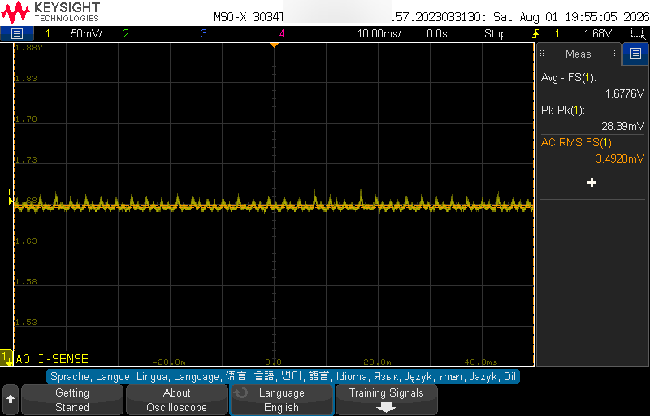

| | |
|---|---|
| Channel | 1: A0 I-SENSE |
| Vertical | 50 mV/div |
| Timebase | 10.00 ms/div (about 100 ms across the screen) |
| Acquisition | Stopped; trigger level 1.68 V |
| Average | 1.6776 V |
| Peak-to-peak | 28.39 mV |
| AC RMS | 3.4920 mV |

Across roughly a tenth of a second the sense line holds a steady 1.6776 V and never wanders
more than 28 mV. At this vertical scale the whole trace collapses into a narrow flat band,
which is what a healthy motor turning at constant speed should look like.

Converting through the 263.5 mV/A calibration, that 28.39 mV of peak-to-peak movement is
about 108 mA of current ripple, and the 3.4920 mV AC RMS figure is the noise floor of the
entire chain, shunt, amplifier, filter and ADC input together.

That noise floor is the number that matters for fault detection. The smallest threshold the
classifier uses is 30 mV, which sits about 8.6 times above this noise. That margin is why a
healthy motor never trips a false alarm: the noise would have to grow almost ninefold before
it could reach the nearest decision boundary.

### Figure 2: commutation ripple resolved

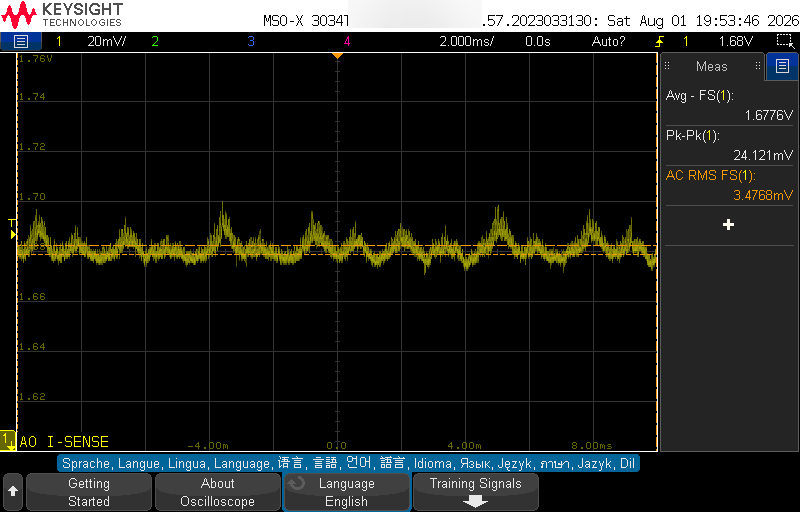

| | |
|---|---|
| Channel | 1: A0 I-SENSE |
| Vertical | 20 mV/div |
| Timebase | 2.000 ms/div |
| Acquisition | Auto trigger |
| Average | 1.6776 V |
| Peak-to-peak | 24.121 mV |
| AC RMS | 3.4768 mV |

The same signal, magnified two and a half times vertically and five times horizontally. What
looked like a flat band in Figure 1 now resolves into a regular, repeating ripple.

Each hump is the driver handing current from one motor phase to the next. This is normal,
healthy behaviour of a three-phase brushless drive, not a defect; the current has to move
between windings as the rotor turns, and each handover shows up as a small bump in what the
supply delivers.

The ripple measures 24.121 mV peak-to-peak, about 92 mA. The average is identical to Figure 1
at 1.6776 V and the AC RMS is essentially unchanged at 3.4768 mV. The signal is stable enough
that zooming in reveals no drift or wandering underneath.

### Figure 3: individual commutation events

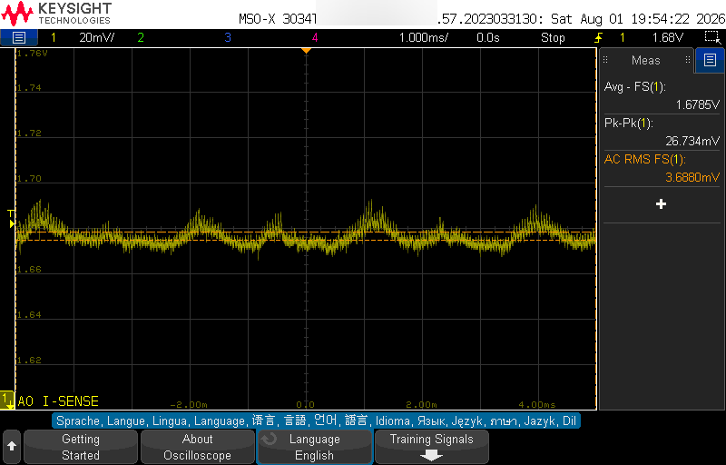

| | |
|---|---|
| Channel | 1: A0 I-SENSE |
| Vertical | 20 mV/div |
| Timebase | 1.000 ms/div |
| Acquisition | Stopped |
| Average | 1.6785 V |
| Peak-to-peak | 26.734 mV |
| AC RMS | 3.6880 mV |

At one millisecond per division the individual phase hand-offs separate out and can be
counted. Each cluster of activity is one commutation event of the three-phase bridge.

The important observation here is one of scale. These switching events happen at the motor's
full bus voltage and full winding current, yet by the time they reach the microcontroller's
analogue input they are only tens of millivolts. That attenuation is the work of the 330 Ω
and 10 nF filter between the amplifier output and the ADC pin.

Peak-to-peak has risen slightly to 26.734 mV and AC RMS to 3.6880 mV compared with Figure 2.
That is expected: a faster timebase captures the sharp edges of each switching event more
faithfully instead of averaging them away.

### Figure 4: finest timebase, the noise floor itself

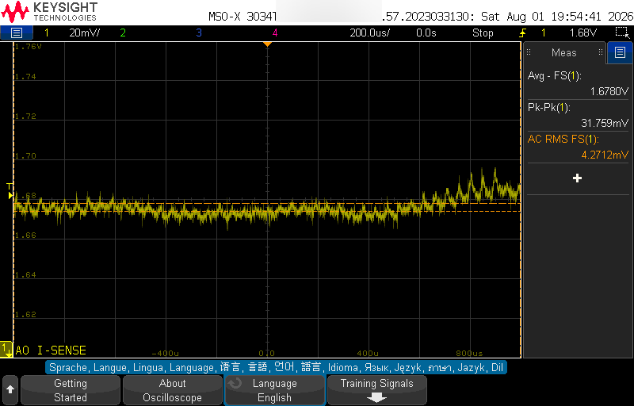

| | |
|---|---|
| Channel | 1: A0 I-SENSE |
| Vertical | 20 mV/div |
| Timebase | 200.0 µs/div |
| Acquisition | Stopped |
| Average | 1.6780 V |
| Peak-to-peak | 31.759 mV |
| AC RMS | 4.2712 mV |

The fastest sweep of the four. For most of the window the trace is simply the noise floor of
the measurement chain, a fuzzy band a few millivolts thick with no structure to it.

Toward the right-hand edge a burst of larger activity appears. That is a single commutation
event caught inside the window, and it is what pushes peak-to-peak up to 31.759 mV and AC RMS
to 4.2712 mV, both the highest of the four current captures.

This capture separates the two things that are easy to confuse. The quiet stretch is genuine
electronic noise, always present. The burst is real signal from the motor. A fault threshold
has to sit above the first and below the second, and these four figures together show there
is comfortable room between them.

---

## 4. Shaft speed: Hall sensors

Three captures, one from each Hall sensor. Because the scope measures frequency directly,
each is an independent check of the speed the dashboard was reporting at the time.

### Figure 5: Hall A

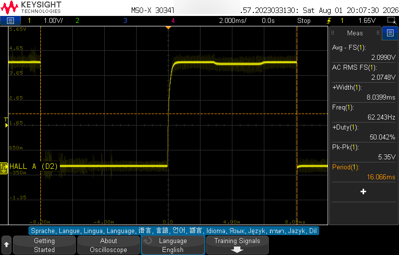

| | |
|---|---|
| Channel | 1: HALL A (D2) |
| Vertical | 1.00 V/div |
| Timebase | 2.000 ms/div |
| Frequency | 62.243 Hz |
| Period | 16.066 ms |
| Positive width | 8.0399 ms |
| Duty cycle | 50.042 % |
| Peak-to-peak | 5.35 V |
| Average | 2.0990 V |
| Calculated speed | 933.6 RPM (60 × 62.243 / 4) |

A clean digital square wave, which is the first thing to confirm: the sensor switches
decisively rather than lingering in the middle, so the microcontroller's edge-counting
interrupts see one unambiguous transition per edge.

The duty cycle of 50.042 % is close to perfect. Since each Hall sensor is high while a
magnetic pole passes it and low while the opposite pole passes, a 50 % duty says the rotor's
north and south poles are physically symmetric, a small but real mechanical health indicator.

The 5.35 V peak-to-peak swing confirms the driver is pulling these open-collector outputs up
to its own 5 V rail. That exceeds the 3.3 V the microcontroller runs on, which is why these
three signals had to be routed to 5 V-tolerant pins.

Working the frequency back to shaft speed: 62.243 Hz across four pole-pairs gives 933.6 RPM.

> **Filename does not match the measurement.** This file is named for 1700 RPM, but the
> instrument measured 62.243 Hz, which works out to 933.6 RPM. The capture itself is
> perfectly good; only the name is wrong. It was recorded about one minute before the Hall B
> capture at 930 RPM, and the two measured frequencies are within 2.5 % of each other; both
> were almost certainly taken during the same run at roughly 930 RPM. The filename is kept
> as recorded so it still matches the raw capture log; cite it as 930 RPM.

### Figure 6: Hall B

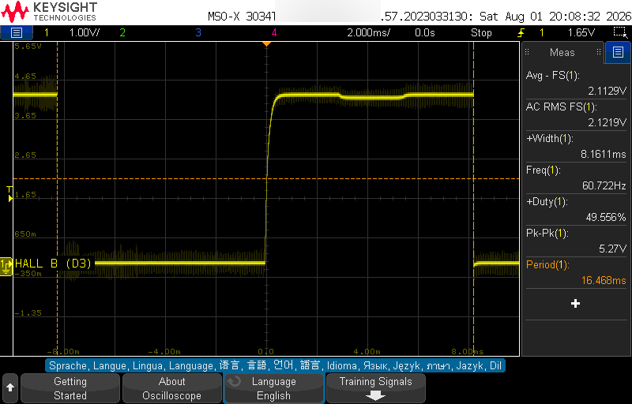

| | |
|---|---|
| Channel | 1: HALL B (D3) |
| Vertical | 1.00 V/div |
| Timebase | 2.000 ms/div |
| Frequency | 60.722 Hz |
| Period | 16.468 ms |
| Positive width | 8.1611 ms |
| Duty cycle | 49.556 % |
| Peak-to-peak | 5.27 V |
| Average | 2.1129 V |
| Calculated speed | 910.8 RPM (60 × 60.722 / 4) |

The second Hall sensor, captured about a minute after Hall A. The waveform is the same shape,
the same amplitude and the same near-50 % duty, which is what you want to see: all three
sensors should behave identically, and any one that did not would point at a failing sensor
or a wiring fault.

The calculated speed is 910.8 RPM against Hall A's 933.6 RPM, a difference of about 2.4 %.
Two captures taken sixty-two seconds apart on an open-loop drive will not land on exactly the
same speed; the driver holds the commanded value approximately, not exactly, and small
changes in load or supply move it slightly. A drift of this size is normal and is itself a
measurement of how tightly the bench holds speed.

### Figure 7: Hall C at high speed

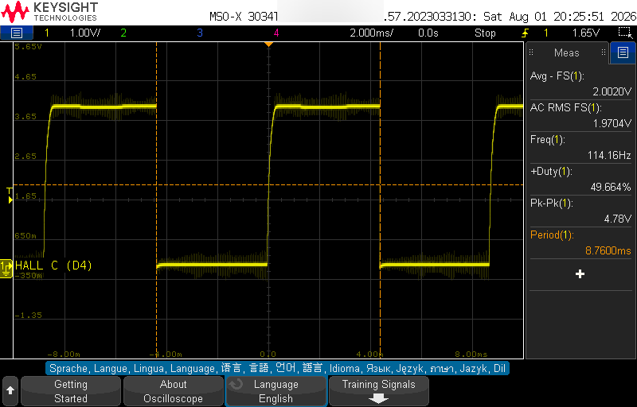

| | |
|---|---|
| Channel | 1: HALL C (D4) |
| Vertical | 1.00 V/div |
| Timebase | 2.000 ms/div |
| Frequency | 114.16 Hz |
| Period | 8.7600 ms |
| Duty cycle | 49.664 % |
| Peak-to-peak | 4.78 V |
| Average | 2.0020 V |
| Calculated speed | 1712.4 RPM (60 × 114.16 / 4) |

The genuine high-speed capture of the set. At 114.16 Hz the period has halved to 8.76 ms
compared with the two captures above, and the calculated shaft speed is 1712.4 RPM. This is
the ~1713 RPM figure cited elsewhere in the project, and it is the one to use whenever a
high-speed Hall waveform is needed.

The duty cycle holds at 49.664 % even at nearly double the speed, confirming that the pole
symmetry seen at low speed is a genuine property of the rotor and not an artefact of one
particular operating point.

One detail is easier to see here than in the slower captures: the rising edges are visibly
sloped rather than vertical. That curve is the pull-up resistor charging the capacitance of
the wiring after the sensor's open-collector output releases. Falling edges are much sharper
because the transistor pulls the line down actively. This asymmetry is normal for
open-collector outputs and is harmless; the edge still crosses the logic threshold cleanly.

---

## 5. Motor temperature: channel A1

Five captures of the thermistor node. Throughout this section, the voltage falls as the motor
gets hotter.

### Figure 8: room temperature, motor running

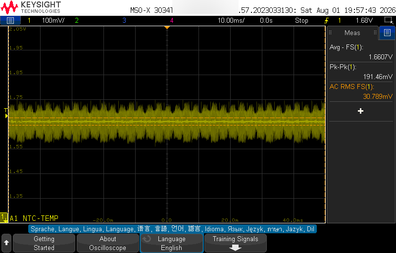

| | |
|---|---|
| Channel | 1: A1 NTC-TEMP |
| Vertical | 100 mV/div |
| Timebase | 10.00 ms/div |
| Acquisition | Stopped |
| Average | 1.6607 V |
| Peak-to-peak | 191.46 mV |
| AC RMS | 30.789 mV |
| Calculated temperature | 24.7 °C (10.13 kΩ thermistor) |

The thermal channel with the motor running but still cool. The average of 1.6607 V
corresponds to a thermistor resistance of 10.13 kΩ, which the B-parameter equation turns into
24.7 °C, a sensible room-temperature reading.

The striking feature is how thick the trace is. Peak-to-peak spans 191.46 mV, with 30.789 mV
of AC RMS. If this raw signal were sampled once and believed, the temperature reading would
jump around by several degrees from one sample to the next.

The cause is the motor driver. This divider node is a relatively high-impedance point, which
makes it an easy target for switching noise radiating from the drive. Figure 9 resolves that
noise properly.

This is exactly why the firmware averages roughly 800 samples for every 100 ms frame rather
than trusting a single conversion. Averaging suppresses random noise in proportion to the
square root of the count, and that is what turns this visibly fuzzy band into the stable
reading shown on the dashboard.

### Figure 9: the switching noise, resolved

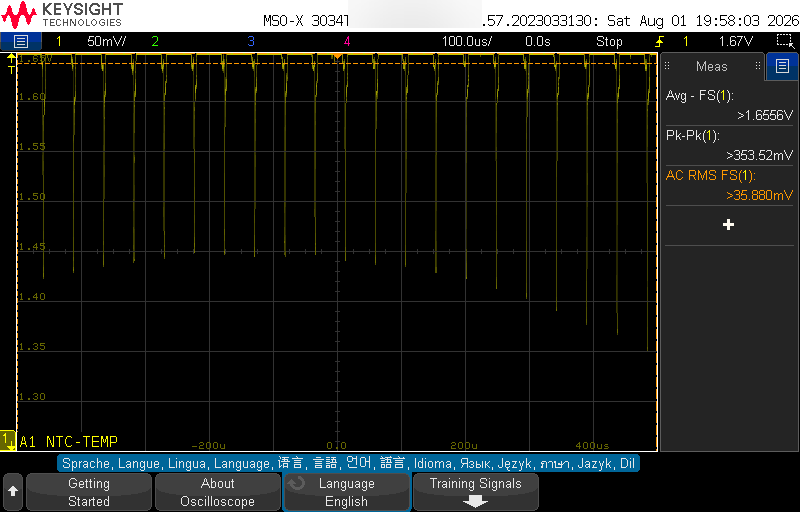

| | |
|---|---|
| Channel | 1: A1 NTC-TEMP |
| Vertical | 50 mV/div |
| Timebase | 100.0 µs/div |
| Acquisition | Stopped |
| Average | > 1.6556 V |
| Peak-to-peak | > 353.52 mV |
| AC RMS | > 35.880 mV |

Zooming into the fuzzy band of Figure 8 by a factor of a hundred in time reveals that it is
not random noise at all. It is a train of narrow, downward spikes at regular spacing, sitting
on an otherwise clean flat level.

Each spike is one switching edge of the motor driver coupling into the sense wiring. They are
brief, a few microseconds, and they all point the same way, downward from the resting level.

That shape is good news for the design. Noise that is narrow and periodic is far easier to
remove by filtering and averaging than noise spread evenly across all frequencies, which is
why the modest capacitor at the ADC node combined with heavy oversampling is enough to
recover a clean temperature.

> **Two caveats on this capture.**
> 1. The instrument prefixes all three measurements with a greater-than sign, which on this
>    scope indicates the waveform runs off the top or bottom of the display so the measurement
>    engine cannot see the full excursion. The values shown are lower bounds, not exact
>    figures; the true peak-to-peak is larger than 353.52 mV. Do not quote these three
>    numbers as precise measurements.
> 2. Counting spikes against the 100 µs graticule puts their spacing at roughly 60 to 70 µs,
>    implying a switching frequency near 15 kHz. Another part of the write-up states this
>    pickup is at 10.6 kHz. Those two figures disagree, and one is wrong. This should be
>    re-measured directly with the scope's frequency cursor, a count taken by eye off a
>    screenshot is not solid enough to overturn it either way.

### Figure 10: motor hot and settled

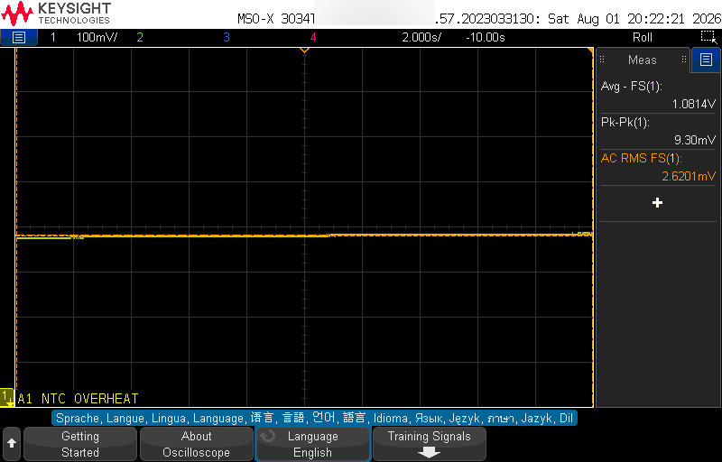

| | |
|---|---|
| Channel | 1: A1 NTC OVERHEAT |
| Vertical | 100 mV/div |
| Timebase | 2.000 s/div, roll mode (about 20 s across screen) |
| Average | 1.0814 V |
| Peak-to-peak | 9.30 mV |
| AC RMS | 2.6201 mV |
| Calculated temperature | 42.1 °C (4.87 kΩ thermistor) |

The motor after heating, held at a steady elevated temperature. The node has fallen to
1.0814 V, which corresponds to a thermistor resistance of 4.87 kΩ and a temperature of 42.1 °C.

Set this against Figure 8 and the case for a simple temperature threshold makes itself. About
17 °C of heating moved this node by roughly 580 mV, an enormous change compared with the few
tens of millivolts of noise on the channel. Detecting overheating does not require anything
clever; the signal is far larger than everything trying to obscure it.

The noise has also almost vanished, from 30.789 mV AC RMS in Figure 8 down to 2.6201 mV here.
The most likely explanation is that the motor was not being driven during this capture, so the
switching noise that dominated Figure 8 was simply not being generated. That is an inference
from the noise level rather than something the screenshot states outright.

> **The filename overstates what this capture contains.** The name calls this a cooling curve,
> but there is no cooling transient on screen. Peak-to-peak across the full twenty-second
> window is 9.30 mV; the trace is flat. What it actually documents is a steady hot level,
> which is still useful evidence, just not evidence of cooling. A genuine cooling curve would
> have to be captured separately, over a window long enough for the motor's thermal mass to
> give up its heat.

### Figure 11: heat gun applied, the thermal transient

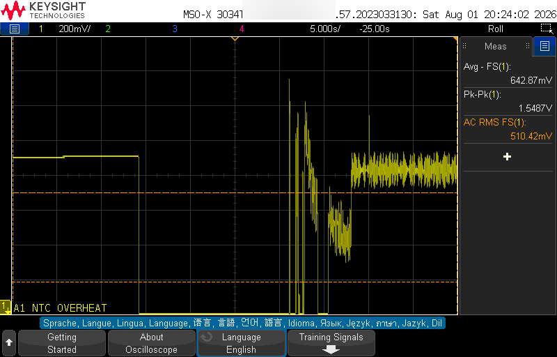

| | |
|---|---|
| Channel | 1: A1 NTC OVERHEAT |
| Vertical | 200 mV/div |
| Timebase | 5.000 s/div, roll mode (about 50 s across screen) |
| Average | 642.87 mV (whole window, including the disturbance) |
| Peak-to-peak | 1.5487 V |
| AC RMS | 510.42 mV |

This is the capture that shows something happening. Reading left to right: the trace begins at
a steady level, then steps downward as the heat gun is applied and the motor case warms, and
finally settles into a lower, noisier band.

Downward means hotter, so this is the fault being induced in real time, the clearest single
piece of evidence in the set that the thermal channel responds to a genuine thermal event.

The violent vertical spikes in the middle deserve a specific warning: they are electrical
interference from the heat gun, not real temperature swings. A heat gun contains a motor and a
high-current heating element, and switching that load near an unshielded sense wire injects
exactly this kind of disturbance. Temperature physically cannot move that fast; the motor's
metal mass takes seconds to tens of seconds to change temperature, which is precisely why the
settled transition either side of the spikes is gradual. Anything faster than that on a
thermal channel is electrical, not thermal.

The 642.87 mV average should be treated with care. It is the mean across a window containing a
steady start, a transition and a heavily disturbed section, so it does not represent any single
temperature. Taken at face value it would imply roughly 61 °C, but the honest description of
this capture is that the motor got hot and the measurement got noisy, with the settled value in
Figure 10 being the trustworthy number for the hot state.

### Figure 12: empty capture

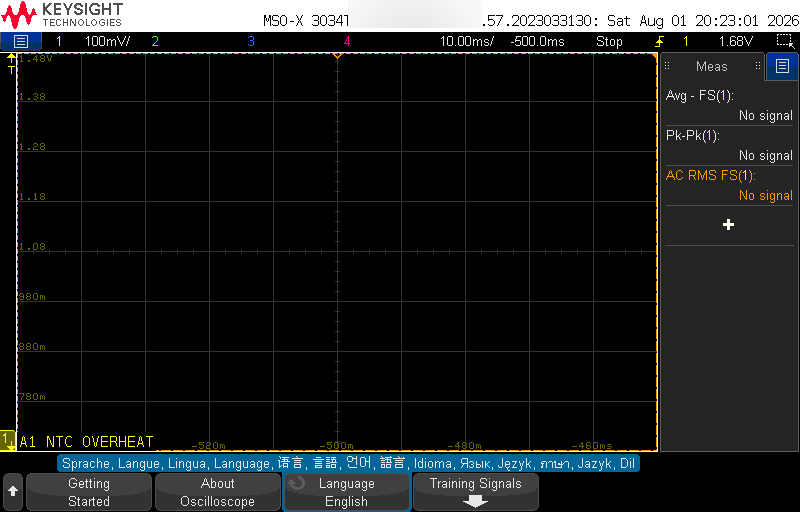

`A1_ntc_OVERHEATED_level_100mVdiv.png` contains no waveform; all measurements read "No signal".
It is kept only so the inventory is complete and is not cited as evidence anywhere.

---

## 6. Data-quality findings

Four issues came out of reviewing these captures. None undermines the system's results; the
evidence for every sensor chain survives, but each is recorded here so no figure is cited
beyond what it actually shows.

**6.1 One file is empty.** `A1_ntc_OVERHEATED_level_100mVdiv.png` contains no waveform and
cannot be cited. Figure 10 covers the same condition properly.

**6.2 One filename contradicts its own measurement.** `HALLA_1700rpm_1Vdiv_2ms.png` measures
62.243 Hz, which is 933.6 RPM, not 1700 RPM. The waveform is good; only the name misleads. The
real 1700 RPM Hall capture is `HALLC_1Vdiv_2ms.png`, which measures 114.16 Hz for 1712.4 RPM.

**6.3 One filename promises more than it shows.** `A1_ntc_OVERHEAT_cooling_curve_roll_2s.png`
shows a flat, settled hot level rather than a cooling curve; the trace varies by only 9.30 mV
over twenty seconds. It is fine evidence of the hot steady state and should be captioned that
way.

**6.4 A frequency worth re-measuring.** The switching noise on the temperature channel is
described elsewhere as 10.6 kHz. Counting the spikes in Figure 9 against the graticule suggests
something closer to 15 kHz. A count by eye from a screenshot is not authoritative, so this is
flagged rather than corrected. Whichever value proves right, it changes no conclusion about the
sensing chain; the filtering and averaging work regardless.

**6.5 What the captures do establish.** Set against those caveats, the substantive results hold
up. The current-sense chain has a measured noise floor of about 3.5 mV RMS against a smallest
fault threshold of 30 mV, a margin of roughly nine to one. All three Hall sensors produce clean
square waves at close to 50 % duty with a full 5 V swing, and the shaft speeds calculated from
their frequencies are self-consistent. The temperature channel moves about 580 mV for 17 °C of
heating, which dwarfs its own noise, and Figure 11 shows it responding to a real thermal event
as it happens.
